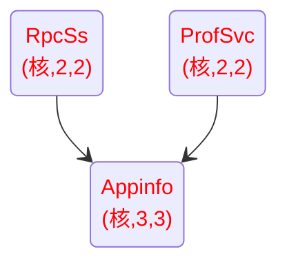

# 组件与服务速查

## Windows 10 服务列表

仅针对系统版本 `19045.5073 22H2`

服务的注册表文件位于 `X:/Windows/System32/config/SYSTEM\ControlSet001\Services`

可以通过 *注册表编辑器* 的 **加载配置单元** 功能来加载离线系统的注册表进行编辑

\*. 有些服务的注册表键根目录不包含 *启动类型 (Start)* 及 *服务类型 (Type)* 键值，本表将不包含这种类型的服务，如 `.NET CLR Data` 、 `adsi` 等等

### 启动类型

|中文名称|注册表对应的 *Start* 键值|
|----|----|
|引导|0|
|系统|1|
|自动|2|
|手动|3|
|禁用|4|

### 服务类型

|名称|注册表对应的 *Type* 键值 16 进制|
|----|----|
|Kernel|1|
|FileSys|2|
|Own|10|
|Share|20|
|User own process template|50|
|User share process template|60|
|Interact|110|

### 服务列表

带 ✰ 的是直接显示在 **计算机管理** 中的服务项

服务按照 **服务名称** 排列

#### 关系图谱 (待施工)

<!-- https://github.com/mermaid-js/mermaid/blob/develop/README.zh-CN.md#%E7%8A%B6%E6%80%81%E5%9B%BE-docs---live-editor -->
<!-- https://mermaid.js.org/syntax/stateDiagram.html -->

#### 系统核心服务

下列服务请勿更改，更改后将会影响系统正常工作

|服务名称1|显示名称2 ( EN / CN )|默认启动类型|优化后启动类型3, 4|服务类型5|备注6, 7|
|----|----|----|----|----|----|
|✰ Appinfo|Application Information|3||20|<u>使用辅助管理权限便于交互式应用程序的运行。如果停止此服务，用户将无法使用辅助管理权限启动应用程序，而执行所需用户任务可能需要这些权限。</u> 禁用将无法运行任何需要提升为管理员权限的软件(就算是管理员账户本身也不行) 此项服务不被依赖 此服务依赖于 `ProfSvc` `RpcSs`|
|✰ DcomLaunch|DCOM Server Process Launcher|2||20|<u>DCOMLAUNCH 服务可启动 COM 和 DCOM 服务器，以响应对象激活请求。如果此服务被停用或禁用，则使用 COM 或 DCOM 的程序将无法正常工作。强烈建议你运行 DCOMLAUNCH 服务。</u> 此项服务作为 `LSM` `RpcSs` 的依赖项必须保留 此项服务无依赖|
|✰ DeviceInstall|Device Install Service|3||20|<u>使计算机在极少或没有用户输入的情况下能识别并适应硬件的更改。终止或禁用此服务会造成系统不稳定。</u> 禁用后系统无法正常识别一些常见硬件，如网卡等 此项服务不被依赖，且无依赖|
|✰ DevicesFlowUserSvc|DevicesFlow|3||60|<u>允许 ConnectUX 和电脑设置连接 WLAN 显示器和蓝牙设备并与其配对。</u> 禁用后，在新设计的 UWP 「 Windows 设置」应用中点击「设备」会让设置应用闪退，无法对连接到电脑上的硬件进行配置|
|✰ EventLog|Windows Event Log|2||20|<u>此服务管理事件和事件日志。它支持日志记录事件、查询事件、订阅事件、归档事件日志以及管理事件元数据。它可以用 XML 和纯文本两种格式显示事件。停止该服务可能危及系统的安全性和可靠性。</u> 禁用后网络管理器无法显示网络设备，且无法连接网络 此项服务无依赖|
|✰ EventSystem|COM+ Event System|2||20|<u>支持系统事件通知服务 (SENS)，此服务为订阅的组件对象模型 (COM) 组件提供自动分布事件功能。如果停止此服务，SENS 将关闭，而且不能提供登录和注销通知。如果禁用此服务，显式依赖此服务的其他服务都将无法启动。</u> 此项服务作为 `SENS` 的依赖项必须保留 此服务依赖于 `RpcSs`|
|✰ fvevol|BitLocker Drive Encryption Filter Driver|0||1|更改此项服务将会导致 **BSOD** 此项服务不被依赖，且无依赖|
|✰ gpsvc|Group Policy Client|2||20|<u>此服务负责应用管理员通过组策略组件为计算机和用户配置的设置。如果禁用此服务，将不会应用这些设置，并且将无法通过组策略管理应用程序和组件。如果禁用此服务，依赖于组策略组件的所有组件或应用程序都将无法正常运行。</u> 若此项服务无法启动，则任何非管理员账户都无法登入 此项服务不被依赖 此服务依赖于 `RpcSs` `Mup`|
|✰ LSM|Local Session Manager|2||20|<u>管理本地用户会话的核心 Windows 服务。停止或禁用此服务将导致系统不稳定。</u> 若更改此服务将会导系开机时卡在点点转圈的步骤，无法启动 此项服务不被依赖 此服务依赖于 `DcomLaunch` `RpcEptMapper` `RpcSs`|
|✰ RpcEptMapper|RPC Endpoint Mapper|2||20|<u>解析 RPC 接口标识符以传输端点。如果此服务被停止或禁用，使用远程过程调用(RPC)服务的程序将无法正常运行。</u> 作为 `EventSystem` `RpcSs` 的依赖而必须保留 此项服务无依赖|
|✰ RpcSs|Remote Procedure Call (RPC)|2||20|<u>RPCSS 服务是 COM 和 DCOM 服务器的服务控制管理器。它执行 COM 和 DCOM 服务器的对象激活请求、对象导出程序解析和分布式垃圾回收。如果此服务被停用或禁用，则使用 COM 或 DCOM 的程序将无法正常工作。强烈建议你运行 RPCSS 服务。</u> 此项服务作为 `Appinfo` `AppXSvc` `BrokerInfrastructure` `ClipSVC` `EventSystem` `WManSvc` 等服务的依赖项必须保留 此服务依赖于 `DcomLaunch` `RpcEptMapper`|
|✰ SENS|System Event Notification Service|2||20|<u>监视系统事件并通知订户这些事件的 COM+ 事件系统。</u> 若此项服务无法启动，则任何非管理员账户都无法登入 此服务依赖于 `EventSystem`|
|✰ SystemEventsBroker|System Events Broker|2||20|<u>协调执行 WinRT 应用程序的后台作业。如果停止或禁用此服务，则可能不会触发后台作业。</u> 此项服务作为 `Schedule` 的依赖项必须保留， `Schedule` 无法拉起本服务，若本服务未运行， `Schedule` 也无法运行 此服务依赖于 `RpcEptMapper` `RpcSs`|
|✰ Themes|Themes|2||20|<u>为用户提供使用主题管理的体验。</u> 在 Windows 10 中禁用本服务会导致部分新设计的窗口无法被移动，无法最大化最小化窗口化，如 Explorer.exe 的窗口 而非新设计的窗口则不受影响，如 Taskmgr.exe 、 mmc.exe 等 此项服务不被依赖，且无依赖|
|✰ UserManager|User Manager|2||20|<u>用户管理器提供多用户交互所需要的运行时组件。如果停止此服务，某些应用程序可能无法正确运行。</u> 若更改此服务将导致用户后 explorer 持续崩毁并反复重启 作为 `TokenBroker` 的依赖 此服务依赖于 `ProfSvc` `RpcSs`|
|✰ WpnUserService|Windows Push Notifications User Service|2|若要支持 UWP 仅可降级成 3 4 = 可 SysPrep, oobe|60|<u>此服务托管为本地通知和推送通知提供支持的 Windows 通知平台。支持的通知为磁贴、Toast 和 Raw。</u> 禁用后，会导致设置 App 的「系统 > 专注助手」、「网络和 Internet 」 提示「缓冲区溢出」并闪退 且 Appx MSIX 文件将会无法安装，并提示「文件系统错误 (-2147219295)」|

#### oobe 相关服务

下列服务禁用后将影响系统进行 oobe

|服务名称1|显示名称2 ( EN / CN )|默认启动类型|优化后启动类型3, 4|服务类型5|备注6, 7|
|----|----|----|----|----|----|
|✰ AppReadiness|App Readiness|3||20|<u>当用户初次登录到这台电脑和添加新应用(UWP?)时，使应用进入就绪可用的状态。</u> 本服务在某些情况下会导致桌面黑屏 Bug ，具体请自行 Google 此项服务不被依赖，且无依赖|
|✰ AppXSvc|AppX Deployment Service (AppXSVC)|3||20|<u>为部署 Microsoft Store 应用程序提供基础结构支持。此服务根据需要启动，如果已禁用的 Microsoft Store 应用程序未部署到系统，此服务可能无法正常工作。</u>UWP 相关 此项服务不被依赖 此服务依赖于 `RpcSs` `StateRepository`|
|✰ BrokerInfrastructure|Background Tasks Infrastructure Service|2||20|<u>控制哪些后台任务可以在系统上运行的 Windows 基础结构服务。</u> 此服务依赖于 `DcomLaunch` `RpcEptMapper` `RpcSs`|
|✰ camsvc|Capability Access Manager Service 功能访问管理器服务|3||20|<u>提供设施，用于管理 UWP 应用对应用功能的访问权限以及检查应用的特定应用功能访问权限</u> 此项服务不被依赖，且无依赖|
|✰ ClipSVC|Client License Service (ClipSVC)|3||20|<u>提供对 Microsoft Store 的基础结构支持。此服务按需启动，并且如果禁用了此服务，则使用 Windows Store 购买的应用程序将无法正常运行。</u> 此项服务不被依赖 此服务依赖于 `RpcSs`|
|✰ DmEnrollmentSvc|Device Management Enrollment Service 设备管理注册服务|3||10|<u>为设备管理执行设备注册活动</u> 禁用本服务会让 oobe 卡在完成网络连接处|
|✰ StateRepository|State Repository Service|3||20|<u>为应用程序模型提供所需的基础结构支持。</u> Windows 10 与 Edge 新增的一些神秘功能，会导致一些 Bug ，禁用之？ 此项服务作为 `AppXSvc` 的依赖项必须保留 此服务依赖于 `RpcSs`|
|✰ TimeBrokerSvc|Time Broker|3||20|<u>协调执行 WinRT 应用程序的后台作业。如果停止或禁用此服务，则可能不会触发后台作业。</u> 此项服务不被依赖，且无依赖|
|✰ TokenBroker|Web 帐户管理器|3||20|<u>Web 帐户管理器利用此服务实现应用和服务的单一登录。</u> 此项服务不被依赖 此服务依赖于 `UserManager`|
|✰ WinHttpAutoProxySvc|WinHTTP Web Proxy Auto-Discovery Service|3||20|<u>WinHTTP 实现了客户端 HTTP 堆栈并向开发人员提供 Win32 API 和 COM 自动化组件以供发送 HTTP 请求和接收响应。此外，通过执行 Web 代理自动发现(WPAD)协议，WinHTTP 还提供对自动发现代理服务器配置的支持。</u> 此项服务作为 `iphlpsvc` 的依赖 此服务依赖于 `Dhcp`|
|✰ WManSvc|Windows Management Service Windows 管理服务|3||20|<u>执行包括预配和注册活动的管理操作</u> 此项服务不被依赖 此服务依赖于 `RpcSs`|

#### 可以降级为 <u>「手动 (按需启动)」</u> 的重要服务

下列服务为 **高重要度**，直接禁用会影响系统正常运行

但可以降级为<u>「手动 (按需启动)」</u> ，降级后可被其他服务正常拉起

|服务名称1|显示名称2 ( EN / CN )|默认启动类型|优化后启动类型3, 4|服务类型5|备注6, 7|
|----|----|----|----|----|----|
|✰ BFE|Base Filtering Engine|2||20|<u>基本筛选引擎(BFE)是一种管理防火墙和 Internet 协议安全(IPsec)策略以及实施用户模式筛选的服务。停止或禁用 BFE 服务将大大降低系统的安全。还将造成 IPsec 管理和防火墙应用程序产生不可预知的行为。</u> 若更改此项服务将会导致用户登录后，系统无法正常工作: explorer 会反复崩溃并自动重启 此服务依赖于 `RpcSs`|
|✰ CoreMessagingRegistrar|CoreMessaging|2||20|<u>Manages communication between system components.</u> 管理系统组件之间的通信。 4 = 不可 SysPrep|
|✰ CryptSvc|Cryptographic Services|2|4 = 可 SysPrep, oobe 会被自动提升设置为 3|20|<u>提供三种管理服务: 编录数据库服务，用于确认 Windows 文件的签名和允许安装新程序；受保护的根服务，它从此计算机添加和删除受信任的根证书颁发机构的证书；自动根证书更新服务，用于从 Windows 更新中检索根证书和启用 SSL 等方案。如果此服务已停止，这些管理服务将无法正常运行。如果此服务已禁用，任何明确依赖它的服务将无法启动。</u>|
|✰ dmwappushservice|Device Management Wireless Application Protocol (WAP) Push message Routing Service 设备管理无线应用程序协议 (WAP) 推送消息路由服务|3|最高只能设为 3|20|<u>路由设备收到的无线应用程序协议 (WAP) 推送消息并同步设备管理会话</u> 4 = 不可 SysPrep|
|✰ iphlpsvc|IP Helper|2||20|<u>使用 IPv6 转换技术(6to4、ISATAP、端口代理和 Teredo)和 IP-HTTPS 提供隧道连接。如果停止该服务，则计算机将不具备这些技术提供的增强连接优势。</u> 4 = 可 SysPrep, 不可 oobe|
|✰ nsi|Network Store Interface Service|2||20|<u>此服务向用户模式客户端发送网络通知(例如，添加/删除接口等)。停止此服务将导致丢失网络连接。如果禁用此服务，则显式依赖此服务的所有其他服务都将无法启动。</u> 4 = 可 SysPrep, 不可 oobe|
|✰ SamSs|Security Accounts Manager|2||20|<u>已准备就绪，可以接受请求。禁用此服务将导致在 SAM 准备就绪时，无法通知系统中的其他服务，从而可能导致这些服务无法正确启动。不应禁用此服务。</u> 禁用后将会导致新用户账户第一次登入时间超级加倍，explorer.exe 卡死，基本无法正常使用系统的情况 4 = 可 SysPrep, oobe|
|✰ Schedule|Task Scheduler|2||20|<u>使用户可以在此计算机上配置和计划自动任务。此服务还托管多个 Windows 系统关键任务。如果此服务被停止或禁用，这些任务将无法在计划的时间运行。如果此服务被禁用，则明确依赖它的所有服务将无法启动。</u> 禁用将导致 CJK 输入法失效，无法在 UWP(包括任务栏托盘区的 Wi-Fi 连接密码输入框) 应用中输入任何字符 此服务依赖于 `RpcSs` `SystemEventsBroker`|
|✰ Winmgmt|Windows Management Instrumentation|2||20|<u>提供共同的界面和对象模式以便访问有关操作系统、设备、应用程序和服务的管理信息。如果此服务被终止，多数基于 Windows 的软件将无法正常运行。如果此服务被禁用，任何依赖它的服务将无法启动。</u> 4 = 可 SysPrep, 不可 oobe|

#### 音频、蓝牙、网络、电源管理等重要服务

因为绝大部分的人都需要，这部分就不测试了，直接保留默认值

|服务名称1|显示名称2 ( EN / CN )|默认启动类型|优化后启动类型3, 4|服务类型5|备注6, 7|
|----|----|----|----|----|----|
|✰ AudioEndpointBuilder|Windows Audio Endpoint Builder|2||20|<u>管理 Windows 音频服务的音频设备。如果停止了此服务，音频设备和效果将无法正常工作。如果禁用了此服务，任何明确依赖它的服务将无法启动</u>|
|✰ Audiosrv|Windows Audio|2||10|<u>管理基于 Windows 的程序的音频。如果此服务被停止，音频设备和效果将不能正常工作。如果此服务被禁用，任何依赖它的服务将无法启动</u>|
|✰ BluetoothUserService|Bluetooth User Support Service 蓝牙用户支持服务|3||60|<u>蓝牙用户服务支持与每个用户会话相关的蓝牙功能的正确运行。</u>|
|✰ BTAGService|Bluetooth Audio Gateway Service 蓝牙音频网关服务|3||20|<u>支持蓝牙免提配置文件的音频网关角色的服务。</u>|
|✰ BthAvctpSvc|AVCTP service AVCTP 服务|3||20|<u>这是音频视频控制传输协议服务</u>|
|✰ bthserv|Bluetooth Support Service 蓝牙支持服务|3||20|<u>蓝牙服务支持发现和关联远程蓝牙设备。停止或禁用此服务可能会导致已安装的蓝牙设备无法正常运行，并使新设备无法被发现或关联。</u>|
|✰ Dhcp|DHCP Client|2||20|<u>为此计算机注册并更新 IP 地址。如果此服务停止，计算机将不能接收动态 IP 地址和 DNS 更新。如果此服务被禁用，所有明确依赖它的服务都将不能启动。</u> 此项服务作为 `WinHttpAutoProxySvc` 的依赖项必须保留 此服务依赖于 `AFD` `nsi`|
|✰ Dnscache|DNS Client|2||20|<u>DNS 客户端服务(dnscache)缓存域名系统(DNS)名称并注册该计算机的完整计算机名。如果该服务被停止，将继续解析 DNS 名称。然而，将不缓存 DNS 名称的查询结果，且不注册计算机名。如果该服务被禁用，则任何明确依赖于它的服务都将无法启动。</u>|
|✰ msiserver|Windows Installer|3||10|<u>添加、修改和删除作为 Windows Installer 程序包(\*.msi、\*.msp)提供的应用程序。如果禁用此服务，则任何显式依赖它的服务均将无法启动。</u>|
|✰ netprofm|Network List Service|3||20|<u>识别计算机已连接的网络，收集和存储这些网络的属性，并在更改这些属性时通知应用程序。</u> 禁用后系统托盘将无法显示网络指示器，且无法连接到任何 Wi-Fi 网络  此服务依赖于 `NlaSvc` `RpcSs`|
|✰ Power|Power|2||20|<u>管理电源策略和电源策略通知传递。</u>|
|✰ QWAVE|Quality Windows Audio Video Experience|3||20|<u>优质 Windows 音频视频体验(qWave)是用于 IP 家庭网络上的音频视频(AV)流应用程序的网络平台。通过确保 AV 应用程序的网络服务质量(QoS)，qWave 增强了 AV 流的性能和可靠性。它提供了许可控制机制、运行时监视和实施、应用程序反馈以及流量优先顺序。</u>|
|✰ TrustedInstaller|Windows Modules Installer|2||10|<u>启用 Windows 更新和可选组件的安装、修改和移除。如果此服务被禁用，则此计算机的 Windows 更新的安装或卸载可能会失败。</u>|
|✰ W32Time|Windows Time|3||20|<u>维护在网络上的所有客户端和服务器的时间和日期同步。如果此服务被停止，时间和日期的同步将不可用。如果此服务被禁用，任何明确依赖它的服务都将不能启动。</u> `Parameters\NtpServer` 中可以修改默认的 NTP 服务器|
|✰ WarpJITSvc|WarpJITSvc|3||10|<u>Provides a JIT out of process service for WARP when running with ACG enabled.</u> 当你的电脑只有核显的时候，会将图形运算转为针对 CPU 运行|
|✰ Wcmsvc|Windows Connection Manager|2||10|<u>根据电脑当前可用的网络连接选项做出自动连接/断开连接决策，并根据“组策略”设置启用网络连接管理。</u>|
|✰ WlanSvc|WLAN AutoConfig|3||10|<u>WLANSVC 服务提供配置、发现、连接、断开与 IEEE 802.11 标准定义的无线局域网(WLAN)的连接所需的逻辑。它还包含将计算机变成软件访问点的逻辑，以便其他设备或计算机可以使用支持它的 WLAN 适配器无线连接到计算机。停止或禁用 WLANSVC 服务将使得计算机上的所有 WLAN 适配器无法访问 Windows 网络连接 UI。强烈建议: 如果你的计算机具有 WLAN 适配器，则运行 WLANSVC 服务。</u>|

#### 其他需求相关的服务

##### 打印机支持

|服务名称1|显示名称2 ( EN / CN )|默认启动类型|优化后启动类型3, 4|服务类型5|备注6, 7|
|----|----|----|----|----|----|
|✰ DeviceAssociationService|Device Association Service|3|4 = 可 SysPrep, oobe|20|<u>在系统与有线或无线设备之间启用匹配。</u> 禁用后无法通过网络添加打印机|
|✰ DsmSvc|Device Setup Manager|3|4 = 可 SysPrep, oobe|20|<u>支持检测、下载和安装与设备相关的软件。如果此服务被禁用，则可能使用过期软件对设备进行配置，因此设备可能无法正常工作。</u> 禁用后，在新设计的 UWP 「 Windows 设置」应用中点击「设备」，将无法看到打印机与扫描仪，但不影响打印机与扫描仪正常工作 用于通过 Windows Update 来自动更新驱动，会造成 CPU 占用异常高的情况，若不用打印机的话建议将其禁用|
|✰ Spooler|Print Spooler|2|4 = 可 SysPrep, oobe|110|<u>该服务在后台执行打印作业并处理与打印机的交互。如果关闭该服务，则无法进行打印或查看打印机。</u>|
|✰ PlugPlay|Plug and Play|3|4 = 可 SysPrep, oobe|20|<u>使计算机在极少或没有用户输入的情况下能识别并适应硬件的更改。终止或禁用此服务会造成系统不稳定。</u>|

#### UWP 支持

我个人需要用到 iCloud ，因此下列服务主要针对 iCloud for Windows (UWP) ，可以正常运行为基准进行测试

在断网安装 Appx Msix 时，会因为无法访问 SmartScreen 而造成下列问题：

<u>**第一次**</u>点开安装包可能会在安装过程中直接闪退，这时需要重新安装该安装包即可，之后可以正常弹出「当前无法访问 SmartScreen」的弹窗，继续点击「运行」即可正常安装

其他一些 UWP 可能无法正常运行，请自行测试

|服务名称1|显示名称2 ( EN / CN )|默认启动类型|优化后启动类型3, 4|服务类型5|备注6, 7|
|----|----|----|----|----|----|
|✰ LicenseManager|Windows License Manager Service Windows 许可证管理器服务|3|4 = 可 SysPrep, oobe|20|<u>为 Microsoft Store 提供基础结构支持。此服务按需启动，如果禁用此服务，则通过 Microsoft Store 获得的内容将无法正常运行。</u> 禁用后，打开 UWP 时会提示「文件系统错误 (-2147416359)」|
|✰ mpssvc|Windows Defender Firewall|2|4 = 可 SysPrep, oobe|20|<u>Windows Defender 防火墙通过阻止未授权用户通过 Internet 或网络访问你的计算机来帮助保护计算机。</u> 若需要 UWP 正常工作，本服务必须设为「2. 自动」 若设为「3. 手动」这本地 Appx MSIX 无法安装，且 UWP 无法运行|
|✰ wlidsvc|Microsoft Account Sign-in Assistant|3|4 = 可 SysPrep, oobe|20|<u>支持用户通过 Microsoft 帐户标识服务登录。如果此服务已停止，用户将无法使用其 Microsoft 帐户登录到此计算机。</u> 禁用后，打开 UWP 时会提示「服务尚未启动」|

#### 笔记本电脑支持

|服务名称1|显示名称2 ( EN / CN )|默认启动类型|优化后启动类型3, 4|服务类型5|备注6, 7|
|----|----|----|----|----|----|
|✰ DisplayEnhancementService|Display Enhancement Service 显示增强服务|3|按需禁用|20|<u>用于管理显示增强(如亮度控制)的服务。</u> 笔记本用户建议保留 台式机用户可直接禁用|
|✰ hidserv|Human Interface Device Service|3|4 = 可 SysPrep, oobe|16|<u>激活键盘、遥控器和其他多媒体设备上的热按钮并继续使用这些按钮。建议你让此服务一直运行。</u> 禁用后键盘上的部分多媒体按键(静音 、 音量+ 、 音量- 等)会失效|

#### 其他需求 (未整理)

这里的服务仍未整理，智能卡 (Yubico) 、扫描仪、摄像头相关

|服务名称1|显示名称2 ( EN / CN )|默认启动类型|优化后启动类型3, 4|服务类型5|备注6, 7|
|----|----|----|----|----|----|
|✰ CertPropSvc|Certificate Propagation|3||20|<u>将用户证书和根证书从智能卡复制到当前用户的证书存储，检测智能卡何时插入到智能卡读卡器中，并在需要时安装智能卡即插即用微型驱动器。</u>|
|✰ FrameServer|Windows Camera Frame Server|3|4 = 可 SysPrep, oobe 偶尔用摄像头，保留|20|<u>允许多个客户端从相机设备访问视频帧。</u> 摄像头相关|
|✰ SCardSvr|Smart Card|3|4 = 可 SysPrep, oobe 我用 Yubico|20|<u>管理此计算机对智能卡的取读访问。如果此服务被终止，此计算机将无法取读智能卡。如果此服务被禁用，任何依赖它的服务将无法启动。</u>|
|✰ ScDeviceEnum|Smart Card Device Enumeration Service|3|4 = 可 SysPrep, oobe 我用 Yubico|20|<u>为给定会话可访问的所有智能卡读卡器创建软件设备节点。如果已禁用此服务，则 WinRT API 将无法枚举智能卡读卡器。</u>|
|✰ SCPolicySvc|Smart Card Removal Policy|3|4 = 可 SysPrep, oobe 我用 Yubico|20|<u>允许系统配置为移除智能卡时锁定用户桌面</u>|
|✰ stisvc|Windows Image Acquisition (WIA)|3|4 = 可 SysPrep, oobe 我用扫描仪|10|<u>为扫描仪和照相机提供图像采集服务</u>|
|✰ WiaRpc|Still Image Acquisition Events|3|4 = 可 SysPrep, oobe 摄像头、打印机、扫描仪相关|20|<u>启动与静态映像获取事件关联的应用程序。</u>|

### 其他影响不明的服务

待具体测试，禁用后似乎什么也不会影响

|服务名称1|显示名称2 ( EN / CN )|默认启动类型|优化后启动类型3, 4|服务类型5|备注6, 7|
|----|----|----|----|----|----|
|✰ FontCache|Windows Font Cache Service|2|4 = 可 SysPrep, oobe 具体影响需要测试|20|<u>通过缓存常用字体数据优化应用程序的性能。如果尚未运行该服务，则应用程序将启动该服务。也可以禁用该服务，但是这样做会降低应用程序性能。</u> 待测试，真的会降低性能吗？用 Photoshop 2018 测测看|
|✰ InstallService|Microsoft Store Install Service Microsoft Store 安装服务|3|4 = 可 SysPrep, oobe|10|<u>为 Microsoft Store 提供基础结构支持。此服务按需启动，如被禁用，则安装将无法正常运行。</u> 待测试，不知是否影响本地 Appx 文件的安装|
|✰ IpxlatCfgSvc|IP Translation Configuration Service IP 转换配置服务|3|4 = 可 SysPrep, oobe|20|<u>配置和启用从 v4 到 v6 的转换，反之亦然</u>|
|✰ LxpSvc|Language Experience Service 语言体验服务|3|4 = 可 SysPrep, oobe 不会影响系统切换语言，不过还是保留吧|20|<u>为部署和配置 Windows 本地化资源提供基础结构支持。此服务将按需启动，如果禁用，其他 Windows 语言将不会部署到系统，Windows 可能无法正常工作。</u>|
|✰ NcaSvc|Network Connectivity Assistant|3|4 = 可 SysPrep, oobe|20|<u>提供 UI 组件的 DirectAccess 状态通知</u> 根据上述已经优化的列表，只能设为 3 ，4 无法通过 oobe ，需要是更多测试|
|✰ Netman|Network Connections|3|4 = 可 SysPrep, oobe 会被自动提升设置为 3|20|<u>管理“网络和拨号连接”文件夹中对象，在其中你可以查看局域网和远程连接。</u>|
|✰ NetSetupSvc|Network Setup Service|2|4 = 可 SysPrep, oobe|20|<u>网络安装服务用于管理网络驱动程序的安装，并允许配置低级别网络设置。如果停止此服务，可能会取消正在进行的所有驱动程序安装。</u>|
|✰ NgcCtnrSvc|Microsoft Passport Container|3|4 = 可 SysPrep, oobe|20|<u>管理用于针对标识提供者及 TPM 虚拟智能卡为用户进行身份验证的本地用户标识密钥。如果禁用了此服务，则将无法访问本地用户标识密钥和 TPM 虚拟智能卡。建议你不要重新配置此服务。</u>|
|✰ NgcSvc|Microsoft Passport|3|4 = 可 SysPrep, oobe|20|<u>为用于对用户关联的标识提供者进行身份验证的加密密钥提供进程隔离。如果禁用了此服务，则这些密钥的所有使用和管理将无法进行，其中包括应用和网站的计算机登录和单一登录。此服务自动启动和停止。建议你不要重新配置此服务。</u>|
|✰ NlaSvc|Network Location Awareness|2|4 = 可 SysPrep, oobe|20|<u>收集和存储网络的配置信息，并在此信息被修改时向程序发出通知。如果停止此服务，则配置信息可能不可用；如果禁用此服务，则显式依赖此服务的所有服务都将无法启动。</u>|
|✰ PrintNotify|Printer Extensions and Notifications|3|？原版镜像不存在，需要开机过一次才会出现|120|<u>此服务可打开自定义打印机对话框并处理来自远程打印服务器或打印机的通知。如果你关闭此服务，将无法看到打印机扩展或通知。</u>|
|✰ PrintWorkflowUserSvc|PrintWorkflow|3|4 = 可 SysPrep, oobe|60|<u>提供对打印工作流应用程序的支持。如果关闭此服务，可能无法成功打印。</u> 待测试|
|✰ RasAuto|Remote Access Auto Connection Manager|3|4 = 可 SysPrep, oobe|20|<u>无论什么时候，当某个程序引用一个远程 DNS 或者 NetBIOS 名称或者地址，就创建一个到远程的连接。</u>|
|✰ RasMan|Remote Access Connection Manager|3|4 = 可 SysPrep, oobe|20|<u>管理从这台计算机到 Internet 或其他远程网络的拨号和虚拟专用网络(VPN)连接。如果禁用该项服务，则明确依赖该服务的任何服务都将无法启动。</u>|
|✰ TabletInputService|Touch Keyboard and Handwriting Panel Service|3|4 = 可 SysPrep, oobe|20|<u>启用触摸键盘和手写面板笔和墨迹功能</u> 禁用后会造成输入法指示器失灵、输入法不能切换、触屏工作不正常，不建议禁用|
|✰ VaultSvc|Credential Manager|3|4 = 可 SysPrep, oobe|20|<u>为用户、应用程序和安全服务包提供凭据的安全存储和检索。</u> 用于储存如 Samba 服务器、网站等的账号和密码|
|✰ vds|Virtual Disk|3||10|<u>提供用于磁盘、卷、文件系统和存储阵列的管理服务。</u> 会影响 ISO 和 VHD 挂载吗…？|
|✰ WalletService|WalletService|3|4 = 可 SysPrep, oobe|20|<u>电子钱包客户端使用的主机对象</u> 待测试，可能影响 UWP|
|✰ WbioSrvc|Windows Biometric Service|3|4 = 可 SysPrep, oobe|20|<u>Windows 生物识别服务使客户端应用程序能够捕获、比较、操纵和存储生物特征数据，而无需直接访问任何生物识别硬件或示例。该服务宿主在某个特权 SVCHOST 进程中。</u> 待测试，不知是否会影响 Yubico 的使用|
|✰ WEPHOSTSVC|Windows Encryption Provider Host Service|3|4 = 可 SysPrep, oobe|10|<u>Windows Encryption Provider 主机服务代理加密相关功能 - 从第三方加密提供程序到需要评估和应用 EAS 策略的进程。停止此服务将损害连接的邮件帐户已经建立的合规检查</u>|
|✰ WFDSConMgrSvc|Wi-Fi Direct Services Connection Manager Service WLAN Direct 服务连接管理器服务|3|4 = 可 SysPrep, oobe|20|<u>管理与无线服务(包括无线显示和插接)的连接。</u>|

### 可以安全禁用的服务

下列服务将同时禁用 Windows Update 和 Windows Defender

|服务名称1|显示名称2 ( EN / CN )|默认启动类型|优化后启动类型3, 4|服务类型5|备注6, 7|
|----|----|----|----|----|----|
|✰ AarSvc|Agent Activation Runtime|3|4 = 可 SysPrep, oobe|60|<u>Runtime for activating conversational agent applications</u>|
|✰ AJRouter|AllJoyn Router Service|3|4 = 可 SysPrep, oobe|20|<u>路由本地 AllJoyn 客户端的 AllJoyn 消息。如果停止此服务，则自身没有捆绑路由器的 AllJoyn 客户端将无法运行。</u>|
|✰ ALG|Application Layer Gateway Service|3|4 = 可 SysPrep, oobe|10|<u>为 Internet 连接共享提供第三方协议插件的支持</u>|
|✰ AppIDSvc|Application Identity|3|4 = 可 SysPrep, oobe|20|<u>确定并验证应用程序的标识。禁用此服务将阻止强制执行 AppLocker。</u> UWP 相关|
|✰ AppMgmt|Application Management|3|4 = 可 SysPrep, oobe|20|<u>为通过组策略部署的软件处理安装、删除以及枚举请求。如果该服务被禁用，则用户将不能安装、删除或枚举通过组策略部署的软件。如果此服务被禁用，则直接依赖于它的所有服务都将无法启动。</u>|
|✰ AppVClient|Microsoft App-V Client|4||10|<u>Manages App-V users and virtual applications</u>|
|✰ AssignedAccessManagerSvc|AssignedAccessManager Service AssignedAccessManager 服务|3|4 = 可 SysPrep, oobe|20|<u>AssignedAccessManager 服务支持 Windows 中的展台体验。</u>|
|✰ autotimesvc|Cellular Time 手机网络时间|3|4 = 可 SysPrep, oobe|10|<u>此服务基于移动网络中的 NITZ 消息设置时间</u> 手机的蜂窝网络时间，嘲讽一下 NTLite 的中文翻译，翻译成「细胞时间」实在太过可笑|
|✰ AxInstSV|ActiveX Installer (AxInstSV)|3|4 = 可 SysPrep, oobe|20|<u>为从 Internet 安装 ActiveX 控件提供用户帐户控制验证，并基于组策略设置启用对 ActiveX 控件安装的管理。此服务根据要求启动，是否禁用 ActiveX 控件的安装取决于默认浏览器设置。</u> UAC 控制相关?|
|✰ BcastDVRUserService|GameDVR and Broadcast User Service GameDVR 和广播用户服务|3|4 = 可 SysPrep, oobe|60|<u>此用户服务用于游戏录制和实况广播</u>|
|✰ BITS|Background Intelligent Transfer Service|2|4 = 可 SysPrep, oobe|20|<u>使用空闲网络带宽在后台传送文件。如果该服务被禁用，则依赖于 BITS 的任何应用程序(如 Windows 更新或 MSN Explorer)将无法自动下载程序和其他信息。</u>8|
|✰ CaptureService|CaptureService|3|4 = 可 SysPrep, oobe|60|<u>为调用 Windows.Graphics.Capture API 的应用程序启用可选的屏幕捕获功能。</u>|
|✰ cbdhsvc|Clipboard User Service 剪贴板用户服务|3|4 = 可 SysPrep, oobe|60|<u>此用户服务用于剪贴板方案</u> 会被 NTLite 精简，可禁用，可用开源的 [CopyQ](https://github.com/hluk/CopyQ) 代替|
|✰ CDPSvc|Connected Devices Platform Service 连接设备平台服务|2|4 = 可 SysPrep, oobe|20|<u>此服务用于连接设备平台方案</u> 可能与打印机、扫描仪相关，但不确定 也有说法是仅在与 Xbox 连接时有用 待测试，可以先禁用看看|
|✰ CDPUserSvc|Connected Devices Platform User Service 连接设备平台用户服务|2|4 = 可 SysPrep, oobe|60|<u>此用户服务用于连接设备平台方案</u> 可能与打印机、扫描仪相关，但不确定 也有说法是仅在与 Xbox 连接时有用 待测试，可以先禁用看看|
|✰ COMSysApp|COM+ System Application|3|4 = 可 SysPrep, oobe|10|<u>停止该服务，则大多数基于 COM+ 的组件将不能正常工作。如果禁用该服务，则任何明确依赖它的服务都将无法启动。</u>|
|✰ ConsentUxUserSvc|ConsentUX User Service ConsentUX|3|4 = 可 SysPrep, oobe|60|<u>允许 ConnectUX 和电脑设置连接 WLAN 显示器和蓝牙设备并与其配对。</u> ConnectUX 已被弃用|
|✰ CredentialEnrollmentManagerUserSvc|CredentialEnrollmentManagerUserSvc|3|4 = 可 SysPrep, oobe|50|<u>凭据注册管理器</u>|
|✰ CscService|Offline Files|3|4 = 可 SysPrep, oobe|20|<u>脱机文件服务在脱机文件缓存中执行维护活动，响应用户登录和注销事件，实现公共 API 的内部部分，并将相关的事件分配给关心脱机文件活动和缓存更改的用户。</u> Home 版不存在，可禁用之|
|✰ defragsvc|Optimize drives|3|4 = 可 SysPrep, oobe|10|<u>通过优化存储驱动器上的文件来帮助计算机更高效地运行。</u> 经典巨硬式不说人话翻译，人话：定期运行 **磁盘碎片整理** 对于 SSD 有害无利，禁用之|
|✰ DeviceAssociationBrokerSvc|DeviceAssociationBroker|3|4 = 可 SysPrep, oobe|60|<u>Enables apps to pair devices</u> 待测试，1903 之前不存在，估计是允许 UWP 与某些硬件配对|
|✰ DevicePickerUserSvc|DevicePicker|3|4 = 可 SysPrep, oobe|60|<u>此用户服务用于管理 Miracast、DLNA 和拨号用户界面</u> 会被 NTLite 精简，可禁用|
|✰ DevQueryBroker|DevQuery Background Discovery Broker|3|4 = 可 SysPrep, oobe|10|<u>使应用能够发现具有后台任务的设备</u> 经典巨硬式不说人话翻译，人话：后台定期扫描，以发现新设备，并通知系统自动注册新设备|
|✰ diagnosticshub.standardcollector.service|Microsoft (R) 诊断中心标准收集器服务|3|4 = 可 SysPrep, oobe|10|<u>诊断中心标准收集器服务。运行时，此服务会收集实时 ETW 事件，并对其进行处理。</u> 诊断不了故障的故障诊断功能支持|
|✰ diagsvc|Diagnostic Execution Service|3|4 = 可 SysPrep, oobe|20|<u>Executes diagnostic actions for troubleshooting support</u> 诊断不了故障的故障诊断功能支持|
|✰ DiagTrack|Connected User Experiences and Telemetry|2|4 = 可 SysPrep, oobe|10|<u>Connected User Experiences and Telemetry</u> 用户体验数据收集|
|✰ DispBrokerDesktopSvc|Display Policy Service 显示策略服务|2|4 = 可 SysPrep, oobe 不影响 VirtualBox 显卡驱动安装以及任意缩放|20|待测试，远程显示器支持|
|✰ DoSvc|Delivery Optimization|3|4 = 可 SysPrep, oobe Windows Update 相关|20|<u>执行内容传递优化任务</u>8|
|✰ dot3svc|Wired AutoConfig|3|4 = 可 SysPrep, oobe|20|<u>有线自动配置(DOT3SVC)服务负责对以太网接口执行 IEEE 802.1X 身份验证。如果当前有线网络部署强制执行 802.1X 身份验证，则应配置 DOT3SVC 服务运行以用于建立第 2 层连接性和/或用于提供对网络资源的访问权限。DOT3SVC 服务会影响到强制执行 802.1X 身份验证的有线网络。</u>|
|✰ DPS|Diagnostic Policy Service|2|4 = 可 SysPrep, oobe|20|<u>诊断策略服务启用了 Windows 组件的问题检测、疑难解答和解决方案。如果该服务被停止，诊断将不再运行。</u>|
|✰ DsSvc|Data Sharing Service|3|4 = 可 SysPrep, oobe|20|<u>提供应用程序之间的数据代理。</u> 待测试，连巨硬员工都不知道这是什么东西的神秘服务 根据搜索，与 Samba 共享有关，若提供(还是访问也需要?) Samba 服务，此服务必须开启12|
|✰ DusmSvc|Data Usage 数据使用量|2|4 = 可 SysPrep, oobe|10|<u>网络数据使用量，流量上限，限制背景数据，按流量计费的网络。</u>|
|✰ Eaphost|Extensible Authentication Protocol|3|4 = 可 SysPrep, oobe|20|<u>可扩展的身份验证协议(EAP)服务在以下情况下提供网络身份验证: 802.1x 有线和无线、VPN 和网络访问保护(NAP)。EAP 在身份验证过程中也提供网络访问客户端使用的应用程序编程接口(API)，包括无线客户端和 VPN 客户端。如果禁用此服务，该计算机将无法访问需要 EAP 身份验证的网络。</u>|
|✰ EFS|Encrypting File System (EFS)|3|4 = 可 SysPrep, oobe|20|<u>提供用于在 NTFS 文件系统卷上存储加密文件的核心文件加密技术。如果停止或禁用此服务，则应用程序将无法访问加密的文件。</u> 待测试，目测与 BitLocker 相关|
|✰ embeddedmode|Embedded Mode 嵌入模式|3|4 = 可 SysPrep, oobe|20|<u>嵌入模式服务启用与后台应用程序相关的方案。禁用此服务会阻止激活后台应用程序。</u> IoT 版本的特殊功能|
|✰ EntAppSvc|Enterprise App Management Service|3|4 = 可 SysPrep, oobe|20|<u>启用企业应用程序管理。</u>|
|✰ Fax|Fax|3|4 = 可 SysPrep, oobe|10|<u>Enables you to send and receive faxes, utilizing fax resources available on this computer or on the network.</u> 待测试，不知是否会影响扫描仪工作|
|✰ fdPHost|Function Discovery Provider Host|3|4 = 可 SysPrep, oobe|20|<u>FDPHOST 服务承载功能发现(FD)网络发现提供程序。这些 FD 提供程序为简单服务发现协议(SSDP)和 Web 服务发现(WS-D)协议提供网络发现服务。使用 FD 时停止或禁用 FDPHOST 服务将禁用这些协议的网络发现。当该服务不可用时，使用 FD 和依靠这些发现协议的网络服务将无法找到网络服务或资源。</u> 网络发现功能|
|✰ FDResPub|Function Discovery Resource Publication|3|4 = 可 SysPrep, oobe|20|<u>发布该计算机以及连接到该计算机的资源，以便能够在网络上发现这些资源。如果该服务被停止，将不再发布网络资源，网络上的其他计算机将无法发现这些资源。</u> 若在本 PC 共享，本服务可以让该共享资源被其他 PC 发现|
|✰ fhsvc|File History Service|3|4 = 可 SysPrep, oobe|20|<u>将用户文件复制到备份位置以防意外丢失</u>|
|✰ HvHost|HV 主机服务|3|4 = 可 SysPrep, oobe|20|<u>为 Hyper-V 虚拟机监控程序提供接口，以便为主机操作系统提供单分区性能计数器。</u>|
|✰ icssvc|Windows Mobile Hotspot Service Windows 移动热点服务|3|4 = 可 SysPrep, oobe|20|<u>提供与其他设备共享手机网络数据连接的功能。</u>|
|✰ IKEEXT|IKE and AuthIP IPsec Keying Modules|3|4 = 可 SysPrep, oobe|32|<u>IKEEXT 服务托管 Internet 密钥交换(IKE)和身份验证 Internet 协议(AuthIP)键控模块。这些键控模块用于 Internet 协议安全(IPSec)中的身份验证和密钥交换。停止或禁用 IKEEXT 服务将禁用与对等计算机的 IKE/AuthIP 密钥交换。通常将 IPSec 配置为使用 IKE 或 AuthIP，因此停止或禁用 IKEEXT 服务将导致 IPSec 故障并且危及系统的安全。强烈建议运行 IKEEXT 服务。</u>|
|✰ KeyIso|CNG Key Isolation|3|4 = 可 SysPrep, oobe|10|<u>CNG 密钥隔离服务宿主在 LSA 进程中。如一般原则所要求，该服务为私钥和相关加密操作提供密钥进程隔离。该服务在与一般原则要求相一致的安全进程中存储和使用生存期长的密钥。</u> 参见 **CNG**|
|✰ KtmRm|KtmRm for Distributed Transaction Coordinator|3|4 = 可 SysPrep, oobe|20|<u>协调分布式事务处理协调器(MSDTC)和内核事务管理器(KTM)之间的事务。如果不需要，建议保持该服务的停止状态。如果需要，MSDTC 和 KTM 将自动启动该服务。如果此服务已禁用，任何与内核资源管理器交互的 MSDTC 事务将失败，并且任何显式依赖它的服务将无法启动。</u>|
|✰ LanmanServer|Server|2|4 = 可 SysPrep, oobe|20|<u>支持此计算机通过网络的文件、打印、和命名管道共享。如果服务停止，这些功能不可用。如果服务被禁用，任何直接依赖于此服务的服务将无法启动。</u>|
|✰ LanmanWorkstation|Workstation|2|4 = 可 SysPrep, oobe|20|<u>使用 SMB 协议创建并维护客户端网络与远程服务器之间的连接。如果此服务已停止，这些连接将无法使用。如果此服务已禁用，任何明确依赖它的服务将无法启动。</u>|
|✰ lfsvc|Geolocation Service|3|4 = 可 SysPrep, oobe|20|<u>此服务将监视系统的当前位置并管理地理围栏(具有关联事件的地理位置)。如果你禁用此服务，应用程序将无法使用或接收有关地理位置或地理围栏的通知。</u>|
|✰ lltdsvc|Link-Layer Topology Discovery Mapper|3|4 = 可 SysPrep, oobe|10|<u>创建网络映射，它由电脑和设备拓扑(连接)信息以及说明每个电脑和设备的元数据组成。如果禁用此服务，则网络映射将不能正常工作。</u>|
|✰ lmhosts|TCP/IP NetBIOS Helper|3|4 = 可 SysPrep, oobe|20|<u>提供 TCP/IP (NetBT) 服务上的 NetBIOS 和网络上客户端的 NetBIOS 名称解析的支持，从而使用户能够共享文件、打印和登录到网络。如果此服务被停用，这些功能可能不可用。如果此服务被禁用，任何依赖它的服务将无法启动。</u>|
|✰ MapsBroker|Downloaded Maps Manager|2|4 = 可 SysPrep, oobe|10|<u>供应用程序访问已下载地图的 Windows 服务。此服务由访问已下载地图的应用程序按需启动。禁用此服务将阻止应用访问地图。</u>|
|✰ MessagingService|MessagingService|3|4 = 可 SysPrep, oobe|60|<u>支持短信及相关功能的服务。</u>|
|✰ MixedRealityOpenXRSvc|Windows Mixed Reality OpenXR Service|3|4 = 可 SysPrep, oobe|20|<u>Enables Mixed Reality OpenXR runtime functionality</u> 待测试， VR 相关|
|✰ MSiSCSI|Microsoft iSCSI Initiator Service|3|4 = 可 SysPrep, oobe|20|<u>管理从这台计算机到远程 iSCSI 目标设备的 Internet SCSI (iSCSI)会话。如果该服务已停止，则该计算机将无法登录或访问 iSCSI 目标设备。如果该服务已禁用，则所有显式依赖于该服务的服务将不会启动。</u>|
|✰ NaturalAuthentication|Natural Authentication 自然身份验证|3|4 = 可 SysPrep, oobe|20|<u>信号聚合器服务，用于根据时间、网络、地理位置、蓝牙和 CDF 因素评估信号。支持的功能包括设备解锁、动态锁定和动态 MDM 策略</u>|
|✰ NcbService|Network Connection Broker|3|4 = 可 SysPrep, oobe|20|<u>允许 Windows 应用商店应用从 Internet 接收通知的代理连接。</u>|
|✰ NcdAutoSetup|Network Connected Devices Auto-Setup|3|4 = 可 SysPrep, oobe 待测试是否影响即插即用网卡安装|20|<u>网络连接设备自动安装服务会监视和安装连接到合格网络的合格设备。停止或禁用此服务将阻止 Windows 自动发现和安装合格的网络连接设备。用户仍然可以通过用户界面将网络连接设备手动添加到电脑。</u>|
|✰ Netlogon|Netlogon|3|4 = 可 SysPrep, oobe 会被自动提升设置为 3|20|<u>为用户和服务身份验证维护此计算机和域控制器之间的安全通道。如果此服务被停用，计算机可能无法验证用户和服务身份并且域控制器无法注册 DNS 记录。如果此服务被禁用，任何依赖它的服务将无法启动。</u>|
|✰ NetTcpPortSharing|Net.Tcp Port Sharing Service|4||20|<u>提供通过 net.tcp 协议共享 TCP 端口的功能。</u>|
|✰ OneSyncSvc|Sync Host 同步主机|2|4 = 可 SysPrep, oobe|60|<u>此服务将同步邮件、联系人、日历和各种其他用户数据。此服务没有运行时，依赖于此功能的邮件和其他应用程序将无法正常工作。</u>|
|✰ p2pimsvc|Peer Networking Identity Manager|3|4 = 可 SysPrep, oobe|20|<u>向对等名称解析协议(PNRP)和对等分组服务提供标识服务。如果禁用该功能，对等名称解析协议和对等分组服务可能无法正常运行，且某些应用程序(如家庭组和远程协助)可能无法正常运行。</u>|
|✰ p2psvc|Peer Networking Grouping|3|4 = 可 SysPrep, oobe|20|<u>使用对等分组启用多方通信。如果禁用该功能，某些应用程序(如家庭组)可能无法正常运行。</u>|
|✰ PcaSvc|Program Compatibility Assistant Service|3|4 = 可 SysPrep, oobe|20|<u>此服务为程序兼容性助手(PCA)提供支持。PCA 监视由用户安装和运行的程序，并检测已知兼容性问题。如果停止此服务，PCA 将无法正常运行。</u>|
|✰ PeerDistSvc|BranchCache|3|4 = 可 SysPrep, oobe|20|<u>此服务缓存来自本地子网上对等方的网络内容。</u> 用于优化大型企业的内部网络压力的工具|
|✰ perceptionsimulation|Windows Perception Simulation Service Windows 感知模拟服务|3|4 = 可 SysPrep, oobe|10|<u>实现空间感知模拟、虚拟相机管理和空间输入模拟。</u> 可能与 VR 相关|
|✰ PerfHost|Performance Counter DLL Host|3|4 = 可 SysPrep, oobe|10|<u>使远程用户和 64 位进程能够查询 32 位 DLL 提供的性能计数器。如果停止此服务，则只有本地用户和 32 位进程能够查询 32 位 DLL 提供的性能计数器。</u>|
|✰ PhoneSvc|Phone Service|3|4 = 可 SysPrep, oobe|20|<u>在设备上管理电话服务状态</u>|
|✰ PimIndexMaintenanceSvc|Contact Data|3|4 = 可 SysPrep, oobe|60|<u>为联系人数据编制索引以进行快速联系人搜索。如果停止或禁用此服务，你的搜索结果中可能会缺少联系人。</u>|
|✰ pla|Performance Logs & Alerts|3|4 = 可 SysPrep, oobe|20|<u>性能日志和警报根据预配置的计划参数从本地或远程计算机收集性能数据，然后将该数据写入日志或触发警报。如果停止此服务，将不收集性能信息。如果禁用此服务，则明确依赖它的所有服务将无法启动。</u>|
|✰ PNRPAutoReg|PNRP Machine Name Publication Service|3|4 = 可 SysPrep, oobe|20|<u>此服务使用对等名称解析协议发布计算机名称。配置是通过 Netsh 上下文“p2p pnrp peer”管理的</u>|
|✰ PNRPsvc|Peer Name Resolution Protocol|3|4 = 可 SysPrep, oobe|20|<u>使用对等名称解析协议(PNRP)在 Internet 上启用无服务器对等名称解析。如果禁用该功能，则某些对等应用程序和协作应用程序(如远程协助)可能无法运行。</u>|
|✰ PolicyAgent|IPsec Policy Agent|3|4 = 可 SysPrep, oobe|20|<u>Internet 协议安全(IPsec)支持网络级别的对等身份验证、数据原始身份验证、数据完整性、数据机密性(加密)以及重播保护。此服务强制执行通过 IP 安全策略管理单元或命令行工具 "netsh ipsec" 创建的 IPsec 策略。停止此服务时，如果策略需要连接使用 IPsec，可能会遇到网络连接问题。同样，此服务停止时，Windows Defender 防火墙的远程管理也不再可用。</u>|
|✰ PushToInstall|Windows PushToInstall Service Windows PushToInstall 服务|3|4 = 可 SysPrep, oobe|20|<u>为 Microsoft Store 提供基础结构支持。此服务自动启动，如果禁用，则远程安装将无法正常运行。</u> 也与 Windows Update 有关，禁用之|
|✰ RemoteAccess|Routing and Remote Access|4||20|<u>在局域网以及广域网环境中为企业提供路由服务。</u>|
|✰ RemoteRegistry|Remote Registry|4||20|<u>使远程用户能修改此计算机上的注册表设置。如果此服务被终止，只有此计算机上的用户才能修改注册表。如果此服务被禁用，任何依赖它的服务将无法启动。</u>|
|✰ RetailDemo|零售演示服务|3|4 = 可 SysPrep, oobe|20|<u>当设备处于零售演示模式时，零售演示服务将控制设备活动。</u>|
|✰ RmSvc|Radio Management Service 无线电管理服务|3|4 = 可 SysPrep, oobe|20|<u>无线电管理和飞行模式服务</u> 注意：开启飞行模式后， Wi-Fi 将会无论如何都连接不上 禁用本服务后，飞行模式将无法被打开|
|✰ RpcLocator|Remote Procedure Call (RPC) Locator|3|4 = 可 SysPrep, oobe|10|<u>在 Windows 2003 和 Windows 的早期版本中，远程过程调用(RPC)定位器服务可管理 RPC 名称服务数据库。在 Windows Vista 和 Windows 的更新版本中，此服务不提供任何功能，但可用于应用程序兼容性。</u>|
|✰ SDRSVC|Windows Backup Windows 备份|3|4 = 可 SysPrep, oobe|10|<u>提供 Windows 备份和还原功能。</u> 真的有用吗？|
|✰ seclogon|Secondary Logon|3|4 = 可 SysPrep, oobe|20|<u>在不同凭据下启用启动过程。如果此服务被停止，这种类型的登录访问将不可用。如果此服务被禁用，任何明确依赖它的服务都将不能启动。</u> 影响所有「以其他用户身份运行」功能以及以非当前登入用户身份运行的服务项，请勿随意修改|
|✰ SecurityHealthService|Windows Security Service Windows 安全中心服务|3|4 = 可 SysPrep, oobe|10|<u>Windows 安全中心服务处理统一的设备保护和运行状况信息</u> Windows Defender 相关，建议禁用|
|✰ SEMgrSvc|Payments and NFC/SE Manager 付款和 NFC/SE 管理器|3|4 = 可 SysPrep, oobe|10|<u>管理付款和基于近场通信(NFC)的安全元件。</u> 真的有人在 Windows 下用 NFC 付款吗？|
|✰ Sense|Windows Defender Advanced Threat Protection Service|3|4 = 可 SysPrep, oobe|10|<u>Windows Defender 高级威胁防护服务通过监视和报告计算机上发生的安全事件来防范高级威胁。</u>|
|✰ SensorDataService|Sensor Data Service|3|4 = 可 SysPrep, oobe|10|<u>从各种传感器传送数据</u>|
|✰ SensorService|Sensor Service|3|4 = 可 SysPrep, oobe|20|<u>一项用于管理各种传感器的功能的传感器服务。管理传感器的简单设备方向(SDO)和历史记录。加载对设备方向变化进行报告的 SDO 传感器。如果停止或禁用了此服务，则将不会加载 SDO 传感器，因此不会发生自动旋转。来自传感器的历史记录收集也将停止。</u>|
|✰ SensrSvc|Sensor Monitoring Service|3|4 = 可 SysPrep, oobe|20|<u>监视各种传感器，以公开数据和适应系统和用户状态。如果此服务停止或禁用，显示器亮度将不根据照明条件进行调节。停止此服务还可能会影响其他系统功能和特性。</u>|
|✰ SessionEnv|Remote Desktop Configuration|3|4 = 可 SysPrep, oobe|20|<u>远程桌面配置服务(RDCS)负责需要 SYSTEM 上下文的所有远程桌面服务和远程桌面相关的配置和会话维护活动。这些包括每会话临时文件夹、RD 主题和 RD 证书。</u>|
|✰ SgrmBroker|System Guard 运行时监视代理|2|4 = 可 SysPrep, oobe|10|<u>监视并证明 Windows 平台的完整性。</u> Windows Defender 相关，建议禁用|
|✰ SharedAccess|Internet Connection Sharing (ICS)|3|4 = 可 SysPrep, oobe|20|<u>为家庭和小型办公网络提供网络地址转换、寻址、名称解析和/或入侵保护服务。</u> 网络共享相关|
|✰ SharedRealitySvc|Spatial Data Service 空间数据服务|3|4 = 可 SysPrep, oobe|20|<u>此服务用于空间感知方案</u>|
|✰ ShellHWDetection|Shell Hardware Detection|2|4 = 可 SysPrep, oobe|20|<u>为自动播放硬件事件提供通知。</u> 有可能导致外置存储无法弹出，禁用之|
|✰ shpamsvc|Shared PC Account Manager|4||20|<u>Manages profiles and accounts on a SharedPC configured device</u>|
|✰ smphost|Microsoft Storage Spaces SMP|3|4 = 可 SysPrep, oobe|10|<u>Microsoft 存储空间管理提供程序的主机服务。如果阻止或禁用这项服务，则无法管理存储空间。</u> 企业管理功能|
|✰ SmsRouter|Microsoft Windows SMS Router Service. Microsoft Windows SMS 路由器服务。|3|4 = 可 SysPrep, oobe|20|<u>根据规则将消息路由到相应客户端。</u> 手机短信相关功能|
|✰ SNMPTRAP|SNMP Trap SNMP 陷阱|3|4 = 可 SysPrep, oobe|10|<u>接收本地或远程简单网络管理协议 (SNMP) 代理程序生成的陷阱消息并将消息转发到此计算机上运行的 SNMP 管理程序。如果此服务被停用，此计算机上基于 SNMP 的程序将不会接收 SNMP trap 消息。如果此服务被禁用，任何依赖它的服务将无法启动。</u>|
|✰ spectrum|Windows Perception Service Windows 感知服务|3|4 = 可 SysPrep, oobe|10|<u>启用空间感知、空间输入和全息绘制。</u>|
|✰ sppsvc|Software Protection|2|4 = 可 SysPrep, oobe|10|<u>启用 Windows 和 Windows 应用程序的数字许可证的下载、安装和实施。如果禁用该服务，操作系统和许可的应用程序可能以通知模式运行。强烈建议你不要禁用软件保护服务。</u> Windows Defender 相关，建议禁用|
|✰ SSDPSRV|SSDP Discovery|3|4 = 可 SysPrep, oobe|20|<u>当发现了使用 SSDP 协议的网络设备和服务，如 UPnP 设备，同时还报告了运行在本地计算机上使用的 SSDP 设备和服务。如果停止此服务，基于 SSDP 的设备将不会被发现。如果禁用此服务，任何依赖此服务的服务都无法正常启动。</u>|
|✰ ssh-agent|OpenSSH Authentication Agent|4||10|<u>Agent to hold private keys used for public key authentication.</u> 从 Windows 10 的某个版本开始内置的 SSH 服务，不过并不好用|
|✰ sshd|OpenSSH SSH Server|3|4 = 可 SysPrep, oobe|10|<u>SSH protocol based service to provide secure encrypted communications between two untrusted hosts over an insecure network.</u> 从 Windows 10 的某个版本开始内置的 SSH 服务，不过并不好用|
|✰ SstpSvc|Secure Socket Tunneling Protocol Service|3|4 = 可 SysPrep, oobe|20|<u>提供使用 VPN 连接到远程计算机的安全套接字隧道协议(SSTP)的支持。如果该服务被禁用，则用户将无法使用 SSTP 访问远程服务器。</u>|
|✰ StorSvc|Storage Service|2|4 = 可 SysPrep, oobe|10|<u>为存储设置和外部存储扩展提供启用服务</u>|
|✰ svsvc|Spot Verifier|3|4 = 可 SysPrep, oobe|20|<u>验证潜在的文件系统损坏。</u>|
|✰ swprv|Microsoft Software Shadow Copy Provider|3|4 = 可 SysPrep, oobe|10|<u>管理卷影复制服务制作的基于软件的卷影副本。如果该服务被停止，将无法管理基于软件的卷影副本。如果该服务被禁用，任何依赖它的服务将无法启动。</u> Windows 备份相关的一些底层的东西，不好用且用不上|
|✰ SysMain|SysMain|2|4 = 可 SysPrep, oobe|20|<u>维护和提高一段时间内的系统性能。</u> SuperFetch 功能，有用但作用不大，机械硬盘时代的遗老|
|✰ TapiSrv|Telephony|3|4 = 可 SysPrep, oobe|20|<u>提供电话服务 API (TAPI)支持，以便各程序控制本地计算机上的电话服务设备以及通过 LAN 同样运行该服务的服务器上的设备。</u>|
|✰ TermService|Remote Desktop Services|3|4 = 可 SysPrep, oobe|20|<u>允许用户以交互方式连接到远程计算机。远程桌面和远程桌面会话主机服务器依赖此服务。若要防止远程使用此计算机，请清除“系统”属性控制面板项目的“远程”选项卡上的复选框。</u>|
|✰ TieringEngineService|Storage Tiers Management|3|4 = 可 SysPrep, oobe|10|<u>优化系统中所有分层存储空间的存储层中的数据放置。</u> 企业储存管理相关功能|
|✰ TroubleshootingSvc|Recommended Troubleshooting Service 建议疑难解答服务|3|4 = 可 SysPrep, oobe|20|<u>通过应用建议疑难解答启用针对已知问题的自动缓解。如果停止，你的设备将不会获得针对设备上问题的建议疑难解答。</u> 解答不了疑难的疑难解答服务|
|✰ tzautoupdate|Auto Time Zone Updater 自动时区更新程序|4||20|<u>自动设置系统时区。</u>|
|✰ UdkUserSvc|Udk User Service Udk 用户服务|3|4 = 可 SysPrep, oobe|3|允许微软为新的桌面 Shell 新增功能的一个服务|
|✰ UevAgentService|User Experience Virtualization Service|4||10|<u>为应用程序和 OS 设置漫游提供支持</u>|
|✰ UmRdpService|Remote Desktop Services UserMode Port Redirector|3|4 = 可 SysPrep, oobe|20|<u>允许为 RDP 连接重定向打印机/驱动程序/端口</u>|
|✰ UnistoreSvc|User Data Storage|3|4 = 可 SysPrep, oobe|60|<u>处理结构化用户数据(包括联系人信息、日历、消息和其他内容)的存储。如果停止或禁用此服务，使用此数据的应用可能无法正常工作。</u>|
|✰ upnphost|UPnP Device Host|3|4 = 可 SysPrep, oobe|20|<u>允许 UPnP 设备宿主在此计算机上。如果停止此服务，则所有宿主的 UPnP 设备都将停止工作，并且不能添加其他宿主设备。如果禁用此服务，则任何显式依赖于它的服务将都无法启动。</u> 会影响 BT 一类的 UPnP 软件吗？|
|✰ UserDataSvc|User Data Access|3|4 = 可 SysPrep, oobe|60|<u>提供对结构化用户数据(包括联系人信息、日历、消息和其他内容)的应用访问。如果停止或禁用此服务，使用此数据的应用可能无法正常工作。</u>|
|✰ UsoSvc|Update Orchestrator Service 更新 Orchestrator 服务|2|4 = 可 SysPrep, oobe|20|<u>管理 Windows 更新。如果已停止，你的设备将无法下载和安装最新更新。</u>8|
|✰ VacSvc|Volumetric Audio Compositor Service 立体音频组合器服务|3|4 = 可 SysPrep, oobe|10|<u>用于混合现实音频仿真的主机空间分析。</u> 待测试，VR 相关|
|✰ vmicguestinterface|Hyper-V Guest Service Interface|3|4 = 可 SysPrep, oobe|20|<u>为 Hyper-V 主机提供一个接口，以便与虚拟机内运行的特定服务进行交互。</u>|
|✰ vmicheartbeat|Hyper-V Heartbeat Service|3|4 = 可 SysPrep, oobe|20|<u>通过定期报告检测信号来监视此虚拟机的状态。此服务有助于你识别哪些运行的虚拟机已停止响应。</u>|
|✰ vmickvpexchange|Hyper-V Data Exchange Service|3|4 = 可 SysPrep, oobe|20|<u>提供一种机制，用于在虚拟机和运行在物理计算机上的操作系统之间交换数据。</u>|
|✰ vmicrdv|Hyper-V Remote Desktop Virtualization Service Hyper-V 远程桌面虚拟化服务|3|4 = 可 SysPrep, oobe|20|<u>提供一个平台以在虚拟机和物理计算机上运行的操作系统之间进行通信。</u>|
|✰ vmicshutdown|Hyper-V Guest Shutdown Service|3|4 = 可 SysPrep, oobe|20|<u>提供一种机制，用于从物理计算机上的管理界面关闭此虚拟机的操作系统。</u>|
|✰ vmictimesync|Hyper-V Time Synchronization Service|3|4 = 可 SysPrep, oobe|20|<u>将此虚拟机的系统时间与物理计算机的系统时间同步。</u>|
|✰ vmicvmsession|Hyper-V PowerShell Direct Service|3|4 = 可 SysPrep, oobe|20|<u>提供了一种在不使用虚拟网络的情况下，通过 VM 会话使用 PowerShell 管理虚拟机的机制。</u>|
|✰ vmicvss|Hyper-V Volume Shadow Copy Requestor Hyper-V 卷影复制请求程序|3|4 = 可 SysPrep, oobe|20|<u>协调使用卷影复制服务所需的通讯，以从物理计算机上的操作系统备份此虚拟机上的应用程序和数据。</u>|
|✰ VSS|Volume Shadow Copy|3|4 = 可 SysPrep, oobe|10|<u>管理并执行用于备份和其它用途的卷影复制。如果此服务被终止，备份将没有卷影复制，并且备份会失败。如果此服务被禁用，任何依赖它的服务将无法启动。</u>|
|✰ WaaSMedicSvc|Windows Update Medic Service Windows 更新医生服务|3|4 = 可 SysPrep, oobe|20|<u>启用 Windows 更新组件的修正和保护。</u>8|
|✰ wbengine|Block Level Backup Engine Service|3|4 = 可 SysPrep, oobe|10|<u>Windows 备份使用 WBENGINE 服务执行备份和恢复操作。如果用户停止了此服务，这可能会导致当前运行的备份或恢复操作失败。使用此计算机上的 Windows 备份禁用此服务可能会禁用备份和恢复操作。</u>|
|✰ wcncsvc|Windows Connect Now - Config Registrar|3|4 = 可 SysPrep, oobe|20|<u>WCNCSVC 承载 Windows 立即连接配置，该配置是 Microsoft 执行的无线保护设置(WPS)协议。该配置用于配置接入点(AP)或无线设备的无线 LAN 设置。该服务根据需要有计划地启动。</u>|
|✰ WdiServiceHost|Diagnostic Service Host|3|4 = 可 SysPrep, oobe|20|<u>诊断服务主机被诊断策略服务用来承载需要在本地服务上下文中运行的诊断。如果停止该服务，则依赖于该服务的任何诊断将不再运行。</u>|
|✰ WdiSystemHost|Diagnostic System Host|3|4 = 可 SysPrep, oobe|20|<u>诊断系统主机被诊断策略服务用来承载需要在本地系统上下文中运行的诊断。如果停止该服务，则依赖于该服务的任何诊断将不再运行。</u>|
|✰ WdNisSvc|Microsoft Defender Antivirus Network Inspection Service|3|4 = 可 SysPrep, oobe|10|<u>帮助防止针对网络协议中的已知和新发现的漏洞发起的入侵企图</u>|
|✰ WebClient|WebClient|3|4 = 可 SysPrep, oobe|20|<u>使基于 Windows 的程序能创建、访问和修改基于 Internet 的文件。如果此服务被停止，这些功能将不可用。如果此服务被禁用，则明确依赖该服务的任何服务都将无法启动。</u> 微软开发的 WebDav，已被微软弃用|
|✰ wercplsupport|Problem Reports Control Panel Support|3|4 = 可 SysPrep, oobe|20|<u>此服务支持查看、发送和删除“问题报告”控制面板的系统级问题报告。</u>|
|✰ WerSvc|Windows Error Reporting Service|3|4 = 可 SysPrep, oobe|10|<u>允许在程序停止运行或停止响应时报告错误，并允许提供现有解决方案。还允许为诊断和修复服务生成日志。如果此服务被停止，则错误报告将无法正确运行，而且可能不显示诊断服务和修复的结果。</u>|
|✰ WinDefend|Microsoft Defender Antivirus Service|2|4 = 可 SysPrep, oobe|10|<u>帮助用户防止恶意软件及其他潜在的垃圾软件。</u>|
|✰ WinRM|Windows Remote Management (WS-Management)|3|4 = 可 SysPrep, oobe|20|<u>Windows 远程管理(WinRM)服务执行 WS-Management 协议来实现远程管理。WS-Management 是用于远程软件和硬件管理的标准 Web 服务协议。WinRM 服务侦听网络上的 WS-Management 请求并对它们进行处理。通过组策略或使用 winrm.cmd 命令行工具的侦听程序，来配置 WinRM 服务，以使其可通过网络侦听。WinRM 服务提供对 WMI 数据的访问并启用事件集合。事件集合及对事件的订阅需要服务处于运行状态。传输 WinRM 消息时使用 HTTP 和 HTTPS 协议。WinRM 服务不依赖于 IIS ，但在同一计算机上预配置为与 IIS 共享端口。WinRM 服务保留 /wsman URL 前缀。若要防止与 IIS 发生冲突，管理员应确保 IIS 上承载的所有网站均不使用 /wsman URL 前缀。</u>|
|✰ wisvc|Windows Insider Service Windows 预览体验成员服务|3|4 = 可 SysPrep, oobe|20|<u>为 Windows 预览体验计划提供基础结构支持。此服务必须保持启用状态，Windows 预览体验计划才能正常运行。</u> 恭喜你成为了付费测试的一员，正式成为巨硬旗下的正版受害者大冤种|
|✰ wlpasvc|Local Profile Assistant Service 本地配置文件助手服务|3|4 = 可 SysPrep, oobe|20|<u>此服务为订户标识模块提供配置文件管理</u>|
|✰ wmiApSrv|WMI Performance Adapter|3|4 = 可 SysPrep, oobe|10|<u>向网络上的客户端提供 Windows Management Instrumentation (WMI) 提供程序中的性能库信息。只有在激活了性能数据助手时，才会运行此服务。</u> 企业远程控制相关|
|✰ WMPNetworkSvc|Windows Media Player Network Sharing Service|3|4 = 可 SysPrep, oobe|10|<u>使用通用即插即用设备与其他网络播放机和媒体设备共享 Windows Media Player 媒体库</u>|
|✰ workfolderssvc|Work Folders|3|4 = 可 SysPrep, oobe|20|<u>此服务将与工作文件夹服务器同步文件，从而使你能够使用已设置工作文件夹的任何电脑和设备上的文件。</u>|
|✰ WpcMonSvc|Parental Controls 家长控制|3|4 = 可 SysPrep, oobe|10|<u>对 Windows 中的子帐户强制执行家长控制。如果此服务被停止或禁用，家长控制可能无法强制执行。</u> 这个功能是黑人开发的吗？为什么「Mom」直接等同于「家长」|
|✰ WPDBusEnum|Portable Device Enumerator Service|3|4 = 可 SysPrep, oobe|20|<u>强制可移动大容量存储设备的组策略。使应用程序(如 Windows Media Player 和图像导入向导)能够使用可移动大容量存储设备传输和同步内容。</u>|
|✰ WpnService|Windows Push Notifications System Service Windows 推送通知系统服务|2|4 = 可 SysPrep, oobe|20|<u>此服务在会话 0 中运行，并托管通知平台和连接提供程序(用于处理设备与 WNS 服务器之间的连接)。</u> 用于接收来自云端的开发者推送通知，打扰能力 Max ，禁用之|
|✰ wscsvc|Security Center|2|4 = 可 SysPrep, oobe|20|<u>WSCSVC(Windows 安全中心)服务监视并报告计算机上的安全健康设置。健康设置包括防火墙(打开/关闭)、防病毒(打开/关闭/过期)、反间谍软件(打开/关闭/过期)、Windows 更新(自动/手动下载并安装更新)、用户帐户控制(打开/关闭)以及 Internet 设置(推荐/不推荐)。该服务为独立软件供应商提供 COM API 以便向安全中心服务注册并记录其产品的状态。安全和维护 UI 使用该服务在“安全和维护”控制面板中提供 systray 警报和安全健康状况的图形视图。网络访问保护(NAP)使用该服务向 NAP 网络策略服务器报告客户端的安全健康状况，以便进行网络隔离决策。该服务还提供一个公共 API，以允许外部客户以编程方式检索系统的聚合安全健康状况。</u>|
|✰ WSearch|Windows Search|2|4 = 可 SysPrep, oobe|20|<u>为文件、电子邮件和其他内容提供内容索引、属性缓存和搜索结果。</u>|
|✰ WwanSvc|WWAN AutoConfig|3|4 = 可 SysPrep, oobe|20|<u>该服务管理移动宽带(GSM 和 CDMA)数据卡/嵌入式模块适配器和自动配置网络的连接。强烈建议: 保持运行此服务，以便获取移动宽带设备的最佳用户体验。</u>|
|✰ XblAuthManager|Xbox Live 身份验证管理器|3|4 = 可 SysPrep, oobe|20||
|✰ XblGameSave|Xbox Live 游戏保存|3|4 = 可 SysPrep, oobe|20|<u>此服务为 Xbox Live 可保存游戏同步保存数据。如果此服务被停止，游戏保存数据将不会上传至 Xbox Live 或从 Xbox Live 下载。</u>|
|✰ XboxGipSvc|Xbox Accessory Management Service|3|4 = 可 SysPrep, oobe|20|<u>This service manages connected Xbox Accessories.</u>|
|✰ XboxNetApiSvc|Xbox Live 网络服务|3|4 = 可 SysPrep, oobe|20|<u>此服务支持 Windows.Networking.XboxLive 应用程序编程接口。</u>|

### 隐藏服务及驱动项

下列服务不会显示在 **计算机管理** 中，仅可通过 <u>注册表编辑器</u> 进行调整

注册表路径: `\HKEY_LOCAL_MACHINE\SYSTEM\ControlSet001\Services`

#### 系统核心服务

下列服务请勿更改，更改后将会影响系统正常工作

|服务名称1|显示名称2 ( EN / CN )|默认启动类型|优化后启动类型3, 4|服务类型5|备注6, 7|
|----|----|----|----|----|----|
|AFD|Ancillary Function Driver for Winsock|1||1|<u>Ancillary Function Driver for Winsock</u> 此项服务作为 `Dhcp` 的依赖项必须保留|
|Mup|MUP|0||2|<u>多个 UNC 提供程序驱动程序</u> 此项服务作为 `gpsvc` 的依赖项必须保留|
|ProfSvc|User Profile Service|2||20|<u>此服务负责加载和卸载用户配置文件。如果已停止或禁用此服务，用户将无法再成功登录或注销，应用在获取用户数据时可能会出问题，而且为接收配置文件事件通知注册的组件将无法接收这些通知。</u> 此项服务作为 `Appinfo` 的依赖项必须保留|

#### 待测试服务

下列任务尚未测试

|服务名称1|显示名称2 ( EN / CN )|默认启动类型|优化后启动类型3, 4|服务类型5|备注6, 7|
|----|----|----|----|----|----|
|1394ohci|1394 OHCI Compliant Host Controller|3|-|1|微软开发的 1394 驱动|
|3ware||0|3|1|LSI 3ware SCSI 驱动|
|ACPI|Microsoft ACPI Driver|0|-|1|微软开发的 ACPI NT 驱动 更改此项服务将会导致系统 **无法启动**|
|AcpiDev|ACPI Devices driver ACPI 设备驱动程序|3|-|1||
|acpiex|Microsoft ACPIEx Driver|0|-|1|微软开发的 ACPIEx 驱动 更改此项服务将会导致系统 **无法启动**|
|acpipagr|ACPI Processor Aggregator Driver ACPI 处理器聚合器驱动程序|3|-|1||
|AcpiPmi|ACPI Power Meter Driver ACPI 电源表驱动程序|3|-|1||
|acpitime|ACPI Wake Alarm Driver ACPI 唤醒警报驱动程序|3|-|1||
|Acx01000||3|-|1|微软开发的音频 KMDF Class 扩展|
|ADP80XX||0|3|1|PMC-Sierra SPC8x6G SAS/SATA 控制器的驱动|
|afunix|afunix|1||1|???|
|ahcache|Application Compatibility Cache|1|-|1|<u>Cache Compatibility Data and Attributes for Individual PE File</u> 禁用后 **开始菜单** 无法打开 UWP 功能将受影响|
|AppID|AppID Driver AppID 驱动程序|3|-|1|<u>标识应用程序并强制执行软件限制策略。</u> UWP 相关|
|applockerfltr|Smartlocker Filter Driver Smartlocker 筛选器驱动程序|3|-|1|<u>标识由授权的安装程序创建的文件。</u> 用于鉴别签名过的安装包？|
|AppvStrm|AppvStrm|3|4|2|<u>Microsoft App-V Streaming Mini-Filter Driver</u> 会被 NTLite 精简，可禁用|
|AppvVemgr|AppvVemgr|3|4|2|<u>Microsoft App-V Virtual Environment Manager Driver</u> 会被 NTLite 精简，可禁用|
|AppvVfs|AppvVfs|3|4|2|<u>Microsoft App-V VFS Mini-Filter Driver</u> 会被 NTLite 精简，可禁用|
|arcsas|Adaptec SAS/SATA-II RAID Storport's Miniport Driver|0|3|1|PMC-Sierra 开发的 Adaptec SAS RAID WS03 驱动|
|AsyncMac|RAS Asynchronous Media Driver RAS 异步媒体驱动程序|3|-|1|<u>RAS 异步媒体驱动程序</u> 影响与网络相关的 RAS 鉴权|
|atapi|IDE Channel IDE 通道|0|3|1|Microsoft 开发的 ATAPI IDE Miniport 驱动 若不再使用 IDE 硬盘，可以考虑禁用，虚拟机用户请关注硬盘接口类型|
|b06bdrv|QLogic Network Adapter VBD QLogic 网络适配器 VBD|0|3|1|QLogic 光纤通道适配器、融合网络适配器和智能以太网适配器驱动|
|bam|Background Activity Moderator Driver|1|-|1|<u>Controls activity of background applications</u>|
|BasicDisplay||1|-|1|禁用似乎不影响使用，待测试|
|BasicRender||1|-|1|禁用似乎不影响使用，待测试|
|BDESVC|BitLocker Drive Encryption Service|3|3 = 会被拉起 4|20|<u>BDESVC 承载 BitLocker 驱动器加密服务。BitLocker 驱动器加密为操作系统提供安全启动保障，并为 OS、固定卷和可移动卷提供全卷加密功能。使用此服务，BitLocker 可以提示用户执行与已安装卷相关的各种操作，并自动解锁卷而无需用户交互。此外，它还会将恢复信息存储至 Active Directory (如果这种方法可用并且需要这样做)，并确保使用最新的恢复证书。停止或禁用该服务可以防止用户使用此功能。</u>|
|bcmfn2|bcmfn2 Service|3|-|1|BCM Function 2 Device Driver by Windows (R) Win 7 DDK provider??|
|Beep|Beep|2|3|1|可能是主板的蜂鸣器驱动？|
|bindflt|Windows Bind Filter Driver|2|-|2|<u>Binds filesystem namespaces to different locations and hides this remapping from the user</u> 将文件系统命名空间绑定到不同位置，并向用户隐藏这种重新映射??|
|bowser|Bowser 浏览器|3|4|2|<u>NT Lan 管理器数据报接收器驱动程序</u> 即将被 Microsoft 弃用的旧技术|
|BthA2dp|Microsoft Bluetooth A2dp driver|3|-|1|蓝牙相关驱动|
|BthEnum|Bluetooth Enumerator Service 蓝牙枚举器服务|3|-|1||
|BthHFEnum|Microsoft Bluetooth Hands-Free Profile driver Microsoft Bluetooth 免提配置文件驱动程序|3|-|1||
|BthLEEnum|Bluetooth Low Energy Driver 蓝牙低能耗驱动程序|3|-|1||
|BthMini|Bluetooth Radio Driver 蓝牙无线收发器驱动程序|3|-|1||
|BTHMODEM|Bluetooth Modem Communications Driver 蓝牙调制解调器通信驱动程序|3|-|1||
|BTHPORT|Bluetooth Port Driver 蓝牙端口驱动程序|3|-|1||
|BTHUSB|Bluetooth Radio USB Driver 蓝牙无线电收发器 USB 驱动程序|3|-|1||
|bttflt|Microsoft Hyper-V VHDPMEM BTT Filter Microsoft Hyper-V VHDPMEM BTT 筛选器|0|-|1||
|buttonconverter|Service for Portable Device Control devices 针对便携式设备控制装置的服务|3|-|1|部分 HID 设备的驱动，如触屏等|
|CAD|Charge Arbitration Driver 充电均衡驱动程序|3|-|1|笔记本充电相关，台式机可禁用 待测试|
|cdfs|CD/DVD File System Reader|4|-|2|<u>ISO9660/Joliet File System Reader for CD/DVDs. (Core) (All pieces)</u> CD/DVD 文件系统 待测试，是否影响 ISO 文件挂载|
|cdrom|CD-ROM Driver|1||1|待测试，是否影响 ISO 文件挂载|
|cht4iscsi||0|4|1|作用不明，参见 **cht4vbd** ，可能为 Chelsio 光纤网卡驱动|
|cht4vbd|Chelsio Virtual Bus Driver Chelsio 虚拟总线驱动程序|3|4|1|Chelsio 光纤网卡驱动|
|CimFS||1|4|2|类似 WIM 文件的另一种备份格式: Cim 文件的挂载支持 没听说过的东西，先禁用之|
|circlass|Consumer IR Devices|3|4|1|红外线支持|
|CldFlt|Windows Cloud Files Filter Driver|2|-|2|云文件筛选器驱动 待测试，不知是否影响 iCloud (个人需求)|
|CLFS|Common Log (CLFS)|0|-|1|<u>General-purpose logging service</u> 更改此项服务将会导致系统 **无法启动**|
|CmBatt|Microsoft ACPI Control Method Battery Driver Microsoft ACPI 控制方法电池驱动程序|3|-|1||
|CNG||0|-|1|<u>CNG 的关键价值主张之一是加密灵活性，有时称为与加密不可知性。 但是，需要将安全套接字层协议 (SSL) 或传输层安全性 (TLS)、CMS (S/MIME)、IPsec、Kerberos 等协议的实现转换为 CNG，以使此功能具有价值。 在 CNG 级别，必须为所有算法类型（对称、非对称、哈希函数）、随机数生成和其他实用工具函数提供替换和可发现性。 协议级别更改更为重要，因为在许多情况下，协议 API 需要添加以前不存在的算法选择和其他灵活性选项。 CNG 首先在 Windows Vista 中可用，并定位为在整个 Microsoft 软件堆栈中取代 CryptoAPI 的现有用途。</u>9 更改此项服务将会导致系统 **无法启动**|
|cnghwassist|CNG Hardware Assist algorithm provider|4|-|1|参见 **CNG**|
|CompositeBus|Composite Bus Enumerator Driver 复合总线枚举器驱动程序|3|-|1|可能于 MTP 设备驱动有关10|
|condrv|Console Driver|3|-|1|处理各种终端前端 ( CMD 、 PowerShell 等 ) 与终端后端 ( conhost.exe ) 之间的通讯|
|CSC|Offline Files Driver|1|4|1|<u>允许在本地计算机处于脱机状态时使用网络文件。</u> Home 版不存在，可禁用之|
|dam|Desktop Activity Moderator Driver|1|-|1|<u>Controls activity of desktop applications</u>11 当系统即将进入 S3 睡眠状态时，暂停或限制桌面软件的运行状态以节省电力|
|Dfsc|DFS Namespace Client Driver|1|-|2|<u>用于访问 DFS 命名空间的客户端驱动程序</u> Windows 共享网络别名支持，如 `\\Contoso\Public` 等|
|disk|Disk Driver 磁盘驱动程序|0|-|1||
|drmkaud|Microsoft Trusted Audio Drivers|3|-|1|音频驱动|
|DXGKrnl|LDDM Graphics Subsystem|1|-|1|<u>Controls the underlying video driver stacks to provide fully-featured display capabilities.</u> DirectX 图形内核子系统|
|ebdrv|QLogic 10 Gigabit Ethernet Adapter VBD|0|4|1|QLogic 10G 网卡驱动|
|EhStorClass|Enhanced Storage Filter Driver|0|-|1|<u>Enhanced Storage Filter Driver</u> 待测试，目测与加密相关|
|EhStorTcgDrv|Microsoft driver for storage devices supporting IEEE 1667 and TCG protocols 支持 IEEE 1667 和 TCG 协议的 Microsoft 存储设备驱动程序|1|-|1|待测试，目测与加密相关|
|ErrDev|Microsoft Hardware Error Device Driver|3|-|1|目测与设备管理器中，硬件的驱动错误代码相关|
|exfat|exFAT File System Driver|3|-|2||
|fastfat|FAT12/16/32 File System Driver|3|-|2|<u>Note - dependance on CDROM.SYS only if required to read/write DVD-RAM media (which appears as CD class device). (Core) (All pieces)</u>|
|fdc|Floppy Disk Controller Driver 软盘控制器驱动程序|3|4|1|今昔是何年|
|FileCrypt|FileCrypt|1|4|2|<u>Windows sandboxing and encryption filter.</u> 待测试|
|FileInfo|File Information FS MiniFilter|0|-|2|<u>Collects information about files in memory to be consumed by other system services.</u>|
|Filetrace|FileTrace|3|-|2|<u>ETW File Trace Filter</u> 待测试，目测与系统调试有关， ETW = Event Trace for Windows|
|flpydisk|Floppy Disk DriverU 软盘驱动程序|3|4|1|今昔是何年|
|FltMgr|FltMgr|0|-|2|<u>文件系统筛选器管理器驱动程序</u> 更改此项服务将会导致系统 **无法启动**|
|FsDepends|File System Dependency Minifilter|3|-|2|<u>This minifilter tracks the dependencies associated with the various nested volumes/filesystems</u> 更改此项服务将会导致系统 **无法启动**|
|gencounter|Microsoft Hyper-V Generation Counter Microsoft Hyper-V 生成计数器|3|-|1||
|genericusbfn|Generic USB Function Class 通用 USB 函数类|3|-|1||
|GPIOClx0101|Microsoft GPIO Class Extension Driver|3|-|1||
|GpuEnergyDrv|GPU Energy Driver|1|-|1|<u>Computes energy consumed by GPU</u>|
|GraphicsPerfSvc|GraphicsPerfSvc|3|4|20|<u>Graphics performance monitor service</u> Windows 10 Home, Pro, Education, Enterprise (1507, 1511, 1607, 1703) 以上各版本都不包含，禁用之|
|HdAudAddService|Microsoft 1.1 UAA Function Driver for High Definition Audio Service 用于 High Definition Audio 服务的 Microsoft 1.1 UAA 函数驱动程序|3|-|1|音频驱动|
|HDAudBus|Microsoft UAA Bus Driver for High Definition Audio 用于 High Definition Audio 的 Microsoft UAA 总线驱动程序|3|-|1|音频驱动|
|HidBatt|HID UPS Battery Driver HID UPS 电池驱动程序|3|-|1||
|HidBth|Microsoft Bluetooth HID Miniport|3|-|1|蓝牙相关|
|hidi2c|Microsoft I2C HID Miniport Driver Microsoft I2C HID 微型端口驱动程序|3|-|1||
|hidinterrupt|Common Driver for HID Buttons implemented with interrupts 通过中断实施的 HID 按钮的通用驱动程序|3|-|1||
|HidIr|Microsoft Infrared HID Driver|3|4|1|红外线驱动|
|hidspi|Microsoft SPI HID Miniport Driver Microsoft SPI HID 微型端口驱动程序|3|-|1||
|HidUsb|Microsoft HID Class Driver|3|-|1||
|HpSAMD||0||1|HP SAS / SATA 控制器驱动 待测试，RAID 卡驱动吗？|
|HTTP|HTTP Service|3||1||
|hvcrash||4|-|1|目测是 Hyper-V 相关服务|
|hvservice|Hypervisor/Virtual Machine Support Driver|3|-|1||
|HwNClx0101|Microsoft Hardware Notifications Class Extension Driver|3|4|1|Windows 10 Home, Pro, Education, Enterprise (1507, 1511, 1607, 1703) 以上各版本都不包含，禁用之|
|hwpolicy|Hardware Policy Driver|0|-|1|<u>Contains Processor and other policies</u>|
|hyperkbd||3|-|1|Microsoft VMBus Synthetic Keyboard Driver|
|HyperVideo||3|-|1|Microsoft VMBus Video Device Miniport Driver|
|i8042prt|i8042 Keyboard and PS/2 Mouse Port Driver i8042 键盘和 PS/2 鼠标端口驱动程序|3|-|1||
|iagpio|Intel Serial IO GPIO Controller Driver Intel 串行 IO GPIO 控制器驱动程序|3|-|1||
|iai2c|Intel(R) Serial IO I2C Host Controller Intel(R) 串行 IO I2C 主机控制器|3|-|1||
|iaLPSS2i_GPIO2|Intel(R) Serial IO GPIO Driver v2 Intel(R) 串行 IO GPIO 驱动程序 v2|3|-|1||
|iaLPSS2i_GPIO2_BXT_P|Intel(R) Serial IO GPIO Driver v2 Intel(R) 串行 IO GPIO 驱动程序 v2|3|-|1||
|iaLPSS2i_GPIO2_CNL|Intel(R) Serial IO GPIO Driver v2 Intel(R) 串行 IO GPIO 驱动程序 v2|3|-|1||
|iaLPSS2i_GPIO2_GLK|Intel(R) Serial IO GPIO Driver v2 Intel(R) 串行 IO GPIO 驱动程序 v2|3|-|1||
|iaLPSS2i_I2C|Intel(R) Serial IO I2C Driver v2 Intel(R) 串行 IO I2C 驱动程序 v2|3|-|1||
|iaLPSS2i_I2C_BXT_P|Intel(R) Serial IO I2C Driver v2 Intel(R) 串行 IO I2C 驱动程序 v2|3|-|1||
|iaLPSS2i_I2C_CNL|Intel(R) Serial IO I2C Driver v2 Intel(R) 串行 IO I2C 驱动程序 v2|3|-|1||
|iaLPSS2i_I2C_GLK|Intel(R) Serial IO I2C Driver v2 Intel(R) 串行 IO I2C 驱动程序 v2|3|-|1||
|iaLPSSi_GPIO|Intel(R) 串行 IO GPIO 主机控制器驱动程序 Intel(R) Serial IO GPIO Controller Driver|3|-|1||
|iaLPSSi_I2C|Intel(R) Serial IO I2C Controller Driver Intel(R) 串行 IO I2C 控制器驱动程序|3|-|1||
|iaStorAVC|Intel Chipset SATA RAID Controller Intel 芯片集 SATA RAID 控制器|0|-|1||
|iaStorV|Intel RAID Controller Windows 7|0|-|1||
|ibbus|Mellanox InfiniBand Bus/AL (Filter Driver) Mellanox InfiniBand 总线/AL (筛选器驱动程序)|3|-|1||
|IndirectKmd|Indirect Displays Kernel-Mode Driver Indirect Displays 内核模式驱动程序|3|-|1|<u>实现了 Indirect Displays 框架的内核模式驱动程序。</u> 虚拟显示器支持|
|intelide||0|-|1|微软开发的 Intel PCI IDE Driver 更改此项服务将会导致系统 **无法启动**|
|intelpmax|Intel(R) Dynamic Device Peak Power Manager Driver|3|-|1|微软开发的 Intel Power Limit Driver 电源限制驱动？|
|intelppm|Intel Processor Driver|3|-|1||
|iorate|Disk I/O Rate Filter Driver 磁盘 I/O 速率筛选器驱动程序|0|-|1|<u>为磁盘 I/O 流量提供速率控制。</u> 更改此项服务将会导致系统 **无法启动**|
|IpFilterDriver|IP Traffic Filter Driver IP 流量筛选器驱动程序|3|-|10||
|IPMIDRV||3|4|1|微软开发的 WMI IPMI 驱动，企业远程控制相关|
|IPNAT|IP Network Address Translator|3|-|1||
|IPT||2||1|待测试，Intel 处理器的调试追踪功能13|
|isapnp||0|-|1|更改此项服务将会导致系统 **无法启动** 微软开发的 PNP ISA Bus 驱动|
|iScsiPrt|IScsiPort Driver iScsiPort 驱动程序|3|-|1||
|ItSas35i||0|4|1|博通 Avago SAS Gen3.5 驱动，待测试|
|kbdclass|Keyboard Class Driver|3|-|1||
|kbdhid|Keyboard HID Driver|3|-|1||
|kdnic|Microsoft Kernel Debug Network Miniport (NDIS 6.20) Microsoft 内核调试网络微型端口(NDIS 6.20)|3|-|1||
|KSecDD||0|-|1|微软开发的 Kernel Security Support Provider 接口 更改此项服务将会导致系统 **无法启动**|
|KSecPkg||0|-|1|微软开发的 Kernel Security Support Provider 接口 更改此项服务将会导致系统 **无法启动**|
|ksthunk|Kernel Streaming Thunks|3|-|1|音视频流媒体支持|
|lltdio|Link-Layer Topology Discovery Mapper I/O Driver 链路层拓扑发现映射器 I/O 驱动程序|2|-|1||
|LSI_SAS||0|4|1|LSI Fusion-MPT SAS 驱动|
|LSI_SAS2i||0|4|1|LSI SAS Gen2 驱动|
|LSI_SAS3i||0|4|1|博通 Avago SAS Gen3 驱动|
|LSI_SSS||0|4|1|LSI SSS PCIe/Flash|
|luafv|UAC File Virtualization|2|-|2|<u>虚拟化每个用户位置的文件写入失败。</u>|
|mausbhost|MA-USB Host Controller Driver MA-USB 主机控制器驱动程序|3|-|1||
|mausbip|MA-USB IP Filter Driver MA-USB IP 筛选器驱动程序|3|-|1||
|MbbCx|MBB Network Adapter Class Extension|3||1|微软开发的 Windows Mobile Broadband Class Extension，待测试|
|megasas||0|4|1|博通 Avago MEGASAS RAID 控制器驱动|
|megasas2i||0|4|1|博通 Avago MEGASAS RAID 控制器驱动|
|megasas35i||0|4|1|博通 Avago MEGASAS RAID 控制器驱动|
|megasr||0|4|1|LSI MegaRAID Software RAID 驱动|
|Microsoft_Bluetooth_AvrcpTransport|Microsoft Bluetooth Avrcp Transport Driver Microsoft 蓝牙 AVRCP 传输驱动程序|3|-|1||
|mlx4_bus|Mellanox ConnectX Bus Enumerator Mellanox ConnectX 总线枚举器|3|-|1||
|MMCSS|Multimedia Class Scheduler|2||1|<u>Enables relative prioritization of work based on system-wide task priorities. This is intended mainly for multimedia applications.  If this service is stopped, individual tasks resort to their default priority.</u> 待测试|
|Modem||3||1|待测试，微软开发的 Modem 驱动|
|monitor|Microsoft Monitor Class Function Driver Service|3||1|显示器相关|
|mouclass|Mouse Class Driver|3|-|1||
|mouhid|Mouse HID Driver|3|-|1||
|mountmgr|Mount Point Manager|0|-|1|<u>负责维护永久性驱动器号和卷名的驱动程序</u> 更改此项服务将会导致系统 **无法启动**|
|mpsdrv|Windows Defender Firewall Authorization Driver|3||1|<u>Windows Defender Firewall Authorization Driver is a kernel mode driver that provides deep inspection services on inbound and outbound network traffic.</u> 此项服务作为 `mpssvc` 的依赖项必须保留|
|MRxDAV|WebDav Client Redirector Driver|3|-|2|<u>为 WebClient 服务提供 WebDAV 文件访问权限的网络重定向程序</u>|
|mrxsmb|SMB MiniRedirector Wrapper and Engine|3|-|2|<u>执行 SMB 文件系统重定向程序的框架</u>|
|mrxsmb20|SMB 2.0 MiniRedirector|3|-|2|<u>执行 SMB 2.0 协议，该协议提供与 Windows Vista 以及更高版本的服务器上的网络资源的连接</u>|
|MsBridge|Microsoft MAC Bridge Microsoft MAC 桥|3|-|1||
|MSDTC|Distributed Transaction Coordinator|3||10|<u>协调跨多个数据库、消息队列、文件系统等资源管理器的事务。如果停止此服务，这些事务将会失败。如果禁用此服务，显式依赖此服务的其他服务将无法启动。</u> 待测试|
|Msfs||1|-|2||
|msgpiowin32|Common Driver for Buttons, DockMode and Laptop/Slate IndicatorU 用于按钮、停靠模式和笔记本电脑/平板电脑指示器的通用驱动程序|3|-|1||
|mshidkmdf|Pass-through HID to KMDF Filter Driver|3|-|1|<u>Device Filter to provide pass-through interface between HIDCLASS and KMDF</u>|
|mshidumdf|Pass-through HID to UMDF Driver|3|-|1|<u>设备驱动程序在 HIDCLASS 和 UMDF 之间提供传递接口</u>|
|msisadrv||0|-|1|微软开发的 ISA 驱动 更改此项服务将会导致系统 **无法启动**|
|MSKSSRV|Microsoft Streaming Service Proxy Microsoft 流服务代理|3|-|1|音视频流媒体支持|
|MsLldp|Microsoft Link-Layer Discovery Protocol Microsoft 链路层发现协议|2|-|1|<u>Microsoft 链路层发现协议驱动程序</u>|
|MSPCLOCK|Microsoft Streaming Clock Proxy Microsoft 流时钟代理|3|-|1|音视频流媒体支持|
|MSPQM|Microsoft Streaming Quality Manager Proxy Microsoft 流质量管理器代理|3|-|1|音视频流媒体支持|
|MsQuic||3|-|1|QUIC 网络协议支持|
|MsRPC||3|-|1||
|MsSecFlt|Microsoft Security Events Component Minifilter Microsoft 安全事件组件微筛选器|0|4|1|<u>Microsoft 安全事件组件文件系统筛选器驱动程序</u>，待测试|
|mssmbios|Microsoft System Management BIOS Driver|1|-|1||
|MSTEE|Microsoft Streaming Tee/Sink-to-Sink Converter Microsoft 流 Tee/Sink-to-Sink 转换器|3|-|1|音视频流媒体支持|
|MTConfig|Microsoft Input Configuration Driver|3|-|1||
|mvumis||0|4|1|待测试，Marvell Flash 控制器驱动|
|NativeWifiP|NativeWiFi Filter NativeWiFi 筛选器|3|-|1||
|ndfltr|NetworkDirect Service NetworkDirect 服务|3|4|1|待测试，作用不明，禁用之|
|NDIS|NDIS System Driver|0|-|1|<u>NDIS 系统驱动程序</u> 更改此项服务将会导致系统 **无法启动** 微软的网络驱动程序接口规范|
|NdisCap|Microsoft NDIS 捕获|1|-|1|参见 **NDIS**|
|NdisImPlatform|Microsoft Network Adapter Multiplexor Protocol Microsoft 网络适配器多路传送器协议|3|-|1|参见 **NDIS**|
|NdisTapi|Remote Access NDIS TAPI Driver 远程访问 NDIS TAPI 驱动程序|3||10|参见 **NDIS** 待测试，远程控制相关，应该是可以被禁用的|
|Ndisuio|NDIS Usermode I/O Protocol|3|-|1|参见 **NDIS**|
|NdisVirtualBus|Microsoft Virtual Network Adapter Enumerator Microsoft 虚拟网络适配器枚举器|3|-|1|参见 **NDIS**|
|NdisWan|Remote Access NDIS WAN Driver 远程访问 NDIS WAN 驱动程序|3|-|1|参见 **NDIS** 待测试，远程控制相关，应该是可以被禁用的|
|ndiswanlegacy|Remote Access LEGACY NDIS WAN Driver 远程访问旧版 NDIS WAN 驱动程序|3||1|参见 **NdisWan** 待测试，远程控制相关，应该是可以被禁用的|
|NDKPing|NDKPing Driver|3|4|1|RDMA(Remote Direct Memory Access) 连接质量测试|
|ndproxy|NDIS Proxy Driver|3|-|1|参见 **NDIS**|
|Ndu|Windows Network Data Usage Monitoring Driver|2||1|<u>This service provides network data usage monitoring functionality</u> 该服务提供网络数据使用监控功能 待测试，是否影响其他流量监控工具|
|NetAdapterCx|Network Adapter Wdf Class Extension Library|3|-|1||
|NetBIOS|NetBIOS Interface|1|-|2|影响 Windows 共享功能，不建议优化|
|NetBT|NETBT|1|-|1|<u>This service implements NetBios over TCP/IP.</u>参见 **NetBIOS**|
|netvsc||3|-|1|参见 **NDIS** 微软开发的 Virtual NDIS Miniport|
|Npfs||1|-|2||
|npsvctrigc|Named pipe service trigger provider|1|-|1|**请勿更改此项服务**|
|nsiproxy|NSI Proxy Service Driver|1|-|1|参见 **nsi**|
|Ntfs||3|-|2||
|Null||1|-|1||
|nvdimm|Microsoft NVDIMM 设备驱动程序|0||1|待测试，非易失性内存驱动，可能与 SSD 有关|
|nvraid||0||1|待测试，NVIDIA RAID 驱动|
|nvstor||0||1|待测试，NVIDIA SATA 驱动|
|Parport|Parallel port driver|3|4|1|17针插口，现在已经很少见到，禁用之|
|partmgr|Partition driver|0|-|1|<u>用于管理分区并向卷管理器拍卖分区的磁盘类筛选器驱动程序。</u>|
|pci|PCI Bus Driver PCI 总线驱动程序|0|-|1|更改此项服务将会导致系统 **无法启动**|
|pciide||0|-|1|更改此项服务将会导致系统 **无法启动**|
|pcmcia||0|4|1|PCMCIA 又叫 PC卡 已绝种的一种接口，禁用之|
|pcw|Performance Counters for Windows Driver|0||1|待测试，性能计数器驱动|
|pdc|PDC 电源相关性协调器驱动程序|0|-|1|更改此项服务将会导致系统 **无法启动**|
|PEAUTH||2||1|待测试， IoT 版特有功能，官方文档表示可以被[移除](https://learn.microsoft.com/zh-tw/windows/iot/iot-enterprise/optimize/removable-packages/microsoft-windows-peauth-onecore)|
|percsas2i||0|4|1|博通 Avago MEGASAS RAID 控制器驱动|
|percsas3i||0|4|1|博通 Avago MEGASAS RAID 控制器驱动|
|PktMon|Packet Monitor Driver|3||1|待测试，内置的网络诊断工具 ( [pktmon.exe](https://learn.microsoft.com/zh-cn/windows-server/networking/technologies/pktmon/pktmon) )|
|pmem||0|4|1|待测试，非易失性内存驱动，可能与 SSD 有关|
|PNPMEM|Microsoft Memory Module Driver|3|-|1|即插即用 ( Plug and Play ) 储存器驱动|
|portcfg||3|-|1||
|PptpMiniport|WAN Miniport (PPTP) WAN 微型端口(PPTP)|3|-|1||
|Processor|Processor Driver 处理器驱动程序|3|-|1||
|Psched|QoS Packet Scheduler QoS 数据包计划程序|1|4|1|电脑用不上，又不用电脑来做路由器，懂行按自己需要打开即可|
|QWAVEdrv|QWAVE driver|3|-|1|<u>质量 Windows 音频/视频体验组件驱动程序</u>|
|Ramdisk|Windows RAM Disk Driver|0||1|待测试，内存盘驱动，一般而言用不上|
|RasAcd|Remote Access Auto Connection Driver|3|4|1||
|RasAgileVpn|WAN Miniport (IKEv2) WAN 微型端口(IKEv2)|3||1|待测试，与 VPN 有关|
|Rasl2tp|WAN Miniport (L2TP) WAN 微型端口(L2TP)|3|4|1|部分网络环境会用到，例如校园网，我用不到，就先禁用|
|RasPppoe|Remote Access PPPOE Driver 远程访问 PPPOE 驱动程序|3|-|1|国内最普遍的宽带拨号方法，不排除有人直接用电脑拨号而不是用路由器，故保留|
|RasSstp|WAN Miniport (SSTP) WAN 微型端口(SSTP)|3|4|1||
|rdbss|Redirected Buffering Sub System|1|-|2|<u>为网络微型重定向程序提供框架</u>|
|rdpbus|Remote Desktop Device Redirector Bus Driver 远程桌面设备重定向程序总线驱动程序|3|4|1||
|RDPDR|Remote Desktop Device Redirector Driver|3|4|1|<u>远程桌面设备重定向程序驱动程序</u>|
|RdpVideoMiniport|Remote Desktop Video Miniport Driver|3|4|1||
|rdyboost|ReadyBoost|0|4|1|一个已被弃用的旧技术，在机械硬盘配 USB 3.0 的远古时代，微软想出了一个将 USB 3.0 U盘作为系统缓存以提升系统流畅性的精神病优化方法|
|ReFS||3|4|2|一个下一代(历经10年尚未完成开发)的微软文件系统，一旦升级到 ReFS 将无法回退至 NTFS ，而且 ReFS 本身新旧版本就不太兼容，禁用保平安|
|ReFSv1||3|4|2|参见 **ReFS**|
|RFCOMM|Bluetooth Device (RFCOMM Protocol TDI)|3||1|蓝牙相关|
|rhproxy|Resource Hub proxy driver 资源中心代理驱动程序|3|4|1|IoT 版本直接访问定制硬件的功能|
|rspndr|Link-Layer Topology Discovery Responder 链路层拓扑发现响应程序|2|-|1||
|s3cap||3||1|Hyper-V 相关服务|
|sbp2port|SBP-2 Transport/Protocol Bus Driver|0|-|1|电子音乐制作、效果器相关|
|scfilter|Smart card PnP Class Filter Driver|3|-|1|<u>启用智能卡 PnP 的智能卡读卡器筛选驱动程序。</u>|
|scmbus|Microsoft Storage Class Memory Bus Driver Microsoft 存储类内存总线驱动程序|0||1|待测试，非易失性内存驱动|
|sdbus||3|-|1|SD 储存卡相关|
|SDFRd|SDF Reflector SDF 反射器|3||1|待测试，作用不明|
|sdstor|SD Storage Port Driver SD 存储端口驱动程序|3|-|1|SD 储存卡相关|
|SerCx|Serial UART Support Library|3|-|1|串口 UART 相关，虽然现在的电脑大多已经不配备用户可以接入的串口，但实际上很多主板上的控制还会用到串口，例如灯光控制等|
|SerCx2|Serial UART Support Library|3|-|1|参见 **SerCx**|
|Serenum|Serenum Filter Driver|3|-|1|微软开发的 Serial Port Enumerator|
|Serial|Serial port driver 串行端口驱动程序|3|-|1||
|sermouse|Serial Mouse Driver 串行鼠标驱动程序|3|-|1||
|sfloppy|High-Capacity Floppy Disk Drive 大容量软盘驱动器|3|4|1|今昔是何年|
|SgrmAgent|System Guard Runtime Monitor Agent|0|4|1|<u>System Guard Runtime Monitor Agent Driver</u> Windows Defender 相关，建议禁用|
|SiSRaid2||0|4|1|SiS RAID 卡驱动|
|SiSRaid4||0|4|1|SiS RAID 卡驱动|
|SmartSAMD||0|4|1|RAID 相关|
|smbdirect||3|4|2|SMB Direct 共享相关|
|spaceparser|Space Parser|3|-|1|<u>Provides parsing for spaces devices.</u> 更改此项服务将会导致系统 **无法启动**|
|spaceport|Storage Spaces Driver 存储空间驱动程序|0|-|1| 更改此项服务将会导致系统 **无法启动**|
|SpatialGraphFilter|Holographic Spatial Graph Filter|3|4|1|微软自家的 HoloLens AR 眼镜支持？|
|SpbCx|Simple Peripheral Bus Support Library|3|-|1|硬件驱动设计相关|
|srv2|Server SMB 2.xxx Driver|3|-|2|<u>支持与 Windows Vista 以及更高版本的客户端的连接</u>|
|srvnet||3|-|2|网络共享相关|
|stexstor||0|4|1|Promise SuperTrak EX 系列 RAID 卡驱动|
|storahci|Microsoft Standard SATA AHCI Driver Microsoft 标准 SATA AHCI 驱动程序|0|-|1||
|storflt|Microsoft Hyper-V Storage Accelerator Microsoft Hyper-V 存储加速器|0||1||
|stornvme|Microsoft Standard NVM Express Driver|0||1||
|storqosflt|Storage QoS Filter Driver|3|-|2|<u>为存储 I/O 通信提供服务质量。</u>|
|storufs|Microsoft Universal Flash Storage (UFS) Driver Microsoft 通用闪存(UFS)驱动程序|0|-|1||
|storvsc||0||1|待测试，不知道是什么东西，根据名称推测是某种文件系统驱动|
|swenum|Software Bus Driver 软件总线驱动程序|3|-|1|即插即用设备驱动|
|Synth3dVsc||3||1|Hyper-V 、远程桌面相关|
|Tcpip|TCP/IP Protocol Driver|0|-|1|<u>TCP/IP 协议驱动程序</u>|
|Tcpip6|Microsoft IPv6 Protocol Driver|3|-|1||
|tcpipreg|TCP/IP Registry Compatibility|2|-|1|<u>Provides compatibility for legacy applications which interact with TCP/IP through the registry. If this service is stopped, certain applications may have impaired functionality.</u>|
|tdx|NetIO Legacy TDI Support Driver NetIO 旧 TDI 支持驱动程序|1|-|1||
|Telemetry|Intel(R) Telemetry Service Intel(R) 遥测服务|0|4|1||
|terminpt|Microsoft Remote Desktop Input Driver Microsoft 远程桌面输入驱动程序|3|4|1||
|TPM|TPM|3|-|1|<u>TPM 驱动程序</u>|
|TrkWks|Distributed Link Tracking Client|2|4|20|<u>维护某个计算机内或某个网络中的计算机的 NTFS 文件之间的链接。</u>|
|TsUsbFlt|Remote Desktop USB Hub Class Filter Driver|3||1||
|TsUsbGD|远程桌面通用 USB 设备 Remote Desktop Generic USB Device|3||1||
|tsusbhub|Remote Desktop USB Hub|3||1|<u>远程桌面 USB 重定向驱动程序</u>|
|tunnel|Microsoft Tunnel Miniport Adapter Driver Microsoft Tunnel Miniport 适配器驱动程序|3||1||
|UASPStor|USB Attached SCSI (UAS) Driver USB Attached SCSI (UAS) 驱动程序|3||1||
|UcmCx0101|USB Connector Manager KMDF Class Extension|3|-|1||
|UcmTcpciCx0101|UCM-TCPCI KMDF Class Extension|3|-|1||
|UcmUcsiAcpiClient|UCM-UCSI ACPI Client UCM-UCSI ACPI 客户端|3|-|1||
|UcmUcsiCx0101|UCM-UCSI KMDF Class Extension|3|-|1||
|Ucx01000|USB Host Support Library|3|-|1||
|UdeCx|USB Device Emulation Support Library|3|-|1||
|udfs|udfs|4||2|<u>Reads/Writes UDF 1.02,1.5,2.0x,2.5 disc formats, usually found on C/DVD discs. (Core) (All pieces)</u>|
|UEFI|Microsoft UEFI Driver Microsoft UEFI 驱动程序|3||10||
|UevAgentDriver|UevAgentDriver|4||2|<u>User Experience Virtualization Agent Driver</u> 用于保存用户的语言、桌面背景、字体大小、颜色等设定|
|Ufx01000|USB Function Class Extension|3|-|1||
|UfxChipidea|USB Chipidea Controller USB Chipidea 控制器|3|-|1||
|ufxsynopsys|USB Synopsys 控制器 USB Synopsys Controller|3|-|1||
|umbus|UMBus Enumerator Driver|3|-|1||
|UmPass|Microsoft UMPass Driver Microsoft UMPass 驱动程序|3|-|1||
|UrsChipidea|Chipidea USB Role-Switch Driver Chipidea USB 角色切换驱动程序|3|-|1||
|UrsCx01000|USB Role-Switch Support Library|3|-|1||
|UrsSynopsys|Synopsys USB Role-Switch Driver Synopsys USB 角色切换驱动程序|3|-|1||
|usbaudio|USB Audio Driver (WDM)|3|-|1|USB 音频驱动|
|usbaudio2|USB Audio 2.0 Service USB 音频 2.0 服务|3|-|1|USB 音频|
|usbccgp|Microsoft USB Generic Parent Driver Microsoft USB 通用父驱动程序|3|-|1||
|usbcir|eHome Infrared Receiver (USBCIR)|3|4|1|USB eHome 红外线接收器|
|usbehci|Microsoft USB 2.0 Enhanced Host Controller Miniport Driver|3|-|1||
|usbhub|Microsoft USB Standard Hub Driver Microsoft USB 标准集线器驱动程序|3|-|1||
|USBHUB3|SuperSpeed Hub SuperSpeed 集线器|3|-|1||
|usbohci|Microsoft USB Open Host Controller Miniport Driver|3|-|1||
|usbprint|Microsoft USB PRINTER Class|3|-|1||
|usbser|Microsoft USB Serial Driver Microsoft USB 串行驱动程序|3|-|1||
|USBSTOR|USB Mass Storage Driver USB 大容量存储驱动程序|3|-|1||
|usbuhci|Microsoft USB Universal Host Controller Miniport Driver|3|-|1||
|USBXHCI|USB xHCI Compliant Host Controller 符合 USB xHCI 的主机控制器|3|-|1||
|vdrvroot|Microsoft Virtual Drive Enumerator Microsoft 虚拟驱动器枚举器|0|-|1|更改此项服务将会导致系统 **无法启动**|
|VerifierExt|Driver Verifier Extension 驱动程序验证程序扩展|4||1||
|vhdmp||3||1|微软开发的 VHD Miniport 驱动|
|vhf|Virtual HID Framework (VHF) Driver 虚拟 HID 框架(VHF)驱动程序|3||1|<u>实现虚拟 HID 框架(VHF)的内核模式驱动程序</u> VR 相关|
|Vid||1||1|Hyper-V Virtualization Infrastructure 驱动|
|VirtualRender||3||1|Hyper-V 相关|
|vmbus|Virtual Machine Bus 虚拟机总线|0||1|Hyper-V 相关|
|VMBusHID||3||1|Hyper-V 相关|
|vmgid|Microsoft Hyper-V Guest Infrastructure Driver Microsoft Hyper-V 来宾基础结构驱动程序|3||1||
|volmgr|Volume Manager Driver 卷管理器驱动程序|0|-|1|更改此项服务将会导致系统 **无法启动**|
|volmgrx|Dynamic Volume Manager|0|-|1|<u>管理动态磁盘上软件 RAID 卷(跨区卷、带区卷、镜像卷、RAID-5)的卷管理器驱动程序扩展</u> 更改此项服务将会导致系统 **无法启动**|
|volsnap|Volume Shadow Copy driver 卷映像复制驱动程序|0|-|1|<u>用于撷取和管理快照的卷类别筛选器驱动程序。</u> 更改此项服务将会导致系统 **无法启动**|
|volume|Volume driver 卷驱动程序|0|-|1|更改此项服务将会导致系统 **无法启动**|
|vpci|Microsoft Hyper-V Virtual PCI Bus Microsoft Hyper-V 虚拟 PCI 总线|0||1||
|vsmraid||0|4|1|VIA RAID 卡驱动|
|VSTXRAID|VIA StorX Storage RAID Controller Windows Driver|0|4|1||
|vwifibus|Virtual Wireless Bus Driver|3|-|1|<u>Implements bus functionality for Virtual Wireless</u> Wi-Fi 相关|
|vwififlt|Virtual WiFi Filter Driver|1|-|1|Wi-Fi 相关|
|WacomPen|Wacom Serial Pen HID Driver Wacom Serial Pen HID 驱动程序|3|-|1|牛逼， Wacom 有内置驱动|
|wanarp|Remote Access IP ARP Driver 远程访问 IP ARP 驱动程序|3|4|1||
|wanarpv6|Remote Access IPv6 ARP Driver 远程访问 IPv6 ARP 驱动程序|3|4|1||
|wcifs|Windows Container Isolation|2||2|<u>Provides a virtual filesystem view for processes running within Windows Containers</u>|
|wcnfs|Windows Container Name Virtualization|3||2|<u>Virtualizes file system names for processes running within Windows Containers</u>|
|WdBoot|Microsoft Defender Antivirus Boot Driver|0|4|1|<u>Microsoft Defender 防病毒启动驱动程序</u> 待测试|
|Wdf01000|Kernel Mode Driver Frameworks service|0|-|1|共享与各个驱动程序之间的可复用代码|
|WdFilter|Microsoft Defender Antivirus Mini-Filter Driver|0|4|2|<u>Microsoft Defender 防病毒访问恶意软件防护微筛选器驱动程序</u> 待测试|
|wdiwifi|WDI Driver Framework|3|-|1|Wi-Fi 相关驱动|
|WdmCompanionFilter||3|-|1|视频、图形驱动相关|
|WdNisDrv|Microsoft Defender Antivirus Network Inspection System Driver |1|4|3|<u>帮助防止针对网络协议中的已知和新发现的漏洞发起的入侵企图</u>|
|Wecsvc|Windows Event Collector|3||20|<u>此服务将管理对支持 WS-Management 协议的远程源中事件的永久订阅。这包括 Windows Vista 事件日志、硬件以及启用 IPMI 的事件源。该服务将转发的事件存储在本地活动日志中。如果停止或禁用此服务，将无法创建事件订阅，并且无法接受转发的事件。</u>|
|WFPLWFS|Microsoft Windows Filtering Platform Microsoft Windows 筛选平台|0||1|与 Windows 自带的防火墙有关|
|WIMMount|WIMMount|3||2|<u>WIM Image mount service driver</u>|
|WindowsTrustedRT|Windows Trusted Execution Environment Class Extension|0|-|1|更改此项服务将会导致系统 **无法启动**|
|WindowsTrustedRTProxy|Microsoft Windows Trusted Runtime Secure Service Microsoft Windows 可信运行时安全服务|0|-|1|参见 **WindowsTrustedRT**|
|WinMad|WinMad Service WinMad 服务|3|-|1|与摄像头、打印机、扫描仪等图像输入输出设备有关|
|WinNat|Windows NAT Driver|3|-|1|<u>此服务提供网络地址转换功能</u>|
|WINUSB|WinUsb Driver WinUsb 驱动程序|3|-|1|<u>USB 设备的通用驱动程序</u>|
|WinVerbs|WinVerbs Service WinVerbs 服务|3|-|1|**依赖于 <u>ibbus</u>** **被 <u>WinMad</u> 依赖** 与摄像头、打印机、扫描仪等图像输入输出设备有关|
|WmiAcpi|Microsoft Windows Management Interface for ACPI|3||1|企业远程控制相关|
|Wof|Windows Overlay File System Filter Driver|0|-|2|对 WimBoot 的底层支持15|
|WpdUpFltr|WPD Upper Class Filter Driver|3|-|1|影响通过 USB 或网络连接的 PTP 、 MTP 、 大容量存储设备等|
|ws2ifsl|Winsock IFS Driver|4||1|<u></u>与 WinSocket 相关的驱动程序16|
|wuauserv|Windows Update|3|4|20|<u>启用检测、下载和安装 Windows 和其他程序的更新。如果此服务被禁用，这台计算机的用户将无法使用 Windows 更新或其自动更新功能， 并且这些程序将无法使用 Windows 更新代理(WUA) API。</u>|
|WudfPf|User Mode Driver Frameworks Platform Driver|3|-|1|<u> kernel mode driver that uses message-based interprocess communication mechanism to communicate with the driver manager and secure host process to facilitate secure companions</u> 让部分驱动运行在用户态，增强系统安全性|
|WUDFRd|Windows Driver Foundation - User-mode Driver Framework Reflector|3|-|1|<u>A kernel mode driver that uses message-based interprocess communication mechanism to communicate with the driver manager and host process to facilitate UMDF drivers</u> 参见 **WudfPf**|
|xboxgip|Xbox Game Input Protocol Driver Xbox 游戏输入协议驱动程序|1|-|1|各品牌的第三方手柄都会用到|
|xinputhid|XINPUT HID Filter Driver XINPUT HID 筛选器驱动程序|3|-|1|各品牌的第三方手柄都会用到|

### 注释

1. 该服务在 *注册表 (Regedit.exe)* 中的 *键名*
2. 该服务在 *服务 (services.msc)* 中的 *显示名称*
3. `-` 代表不建议优化，或默认为 *手动* 无需优化
4. 优化建议仅针对非公司环境的个人电脑
5. 该值为 *注册表 (Regedit.exe)* 中的 **16 进制** 值(打开值编辑时的默认选项)
6. 资料来源为 [batcmd](https://batcmd.com/windows/10/services/) 、 [Revert Service](https://revertservice.com/10/) 以及个人实机测试
7. 带下划线的为 **Microsoft官方中文描述** (GitHub 不支持显示下划线)
8. 禁用 Windows Update 相关后，无法从 Microsoft Store 安装和更新应用，但你可以通过 [Microsoft Store - Generation Project (v1.2.3) \[by @rgadguard & mkuba50\]](https://store.rg-adguard.net) ，来下载想要安装应用的 Appx 软件包进行本地安装
9. 该服务无描述，官方描述取自 [Microsoft 在线文档](https://learn.microsoft.com/zh-cn/windows/win32/seccng/cng-features)
10. 该服务无描述，参考链接 [file.net](https://www.file.net/process/compositebus.sys.html)
11. 描述节取自 [Microsoft 在线文档](https://learn.microsoft.com/en-us/windows/compatibility/desktop-activity-moderator)
12. 参考链接 [serverfault](https://serverfault.com/questions/829782/what-exactly-is-the-data-sharing-service-in-windows-server-2016)
13. 参考链接 [GitHub](https://github.com/ionescu007/winipt)
14. 参考链接 [维基百科](https://zh.wikipedia.org/wiki/Winsock)
15. 参考链接 [微软开发博客](https://devblogs.microsoft.com/oldnewthing/20190618-00/?p=102597)
16. 参考链接 [安全 KER 的漏洞分析](https://www.anquanke.com/post/id/196893)

[上一级](../README.md)

[笔记首页](../../../README.md)